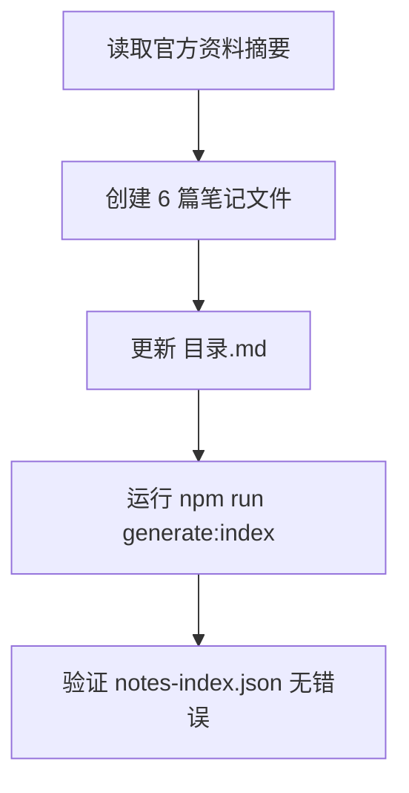

# Design Document: kiro-notes-enhancement

## Overview

本设计文档描述如何为 Vue 3 知识博客补充完整的 Kiro 学习笔记体系。目标是在 `public/notes/AI工具/Kiro/` 目录下创建 6 篇高质量中文学习笔记，覆盖 Kiro 的核心功能（Specs、Steering、Hooks、MCP、工作流实战），并更新目录文件与重新生成索引。

### 设计目标

- 内容准确：所有技术细节基于 Kiro 官方文档（https://kiro.dev），并注明资料来源与时间点
- 风格一致：与同目录 Claude Code、Codex 系列保持相同的写作风格与结构规范
- 系统完整：6 篇笔记形成完整学习路径，从入门到实战
- 工程合规：frontmatter 规范、文件命名、目录更新、索引重建均符合仓库规范

### 内容来源

本系列笔记基于以下官方资料（资料快照时间：2026-04）：

- 官网：https://kiro.dev
- 文档：https://kiro.dev/docs/
- 核心功能覆盖：Specs、Steering、Hooks、MCP、Agent Loop

---

## Architecture

### 文件组织架构

```
public/notes/AI工具/Kiro/
├── 目录.md                                          ← 更新：导航入口
├── 第一篇_Kiro快速上手与核心概念_2026-04.md          ← 新建
├── 第二篇_Kiro_Specs规格系统详解_2026-04.md          ← 新建
├── 第三篇_Kiro_Steering上下文管理_2026-04.md         ← 新建
├── 第四篇_Kiro_Hooks自动化机制_2026-04.md            ← 新建
├── 第五篇_Kiro_MCP集成与工具扩展_2026-04.md          ← 新建
└── 第六篇_Kiro工作流实战与最佳实践_2026-04.md        ← 新建
```

### 生成流程



### 与现有系统的集成点

- `scripts/generateNotesIndex.js`：扫描 `public/notes/**/*.md`，解析 frontmatter，生成 `public/notes-index.json`
- Vue 路由：hash history，笔记路由格式为 `#/note/AI工具/Kiro/{filename_without_extension}`
- 前端渲染：剥离 frontmatter，渲染正文 Markdown，支持 `[[toc]]` 目录指令

---

## Components and Interfaces

### 笔记文件结构（每篇通用模板）

每篇笔记遵循以下结构：

```
[frontmatter 块]
[H1 标题]
[来源说明引用块]
[[toc]]
---
[H2 章节 1]
  [H3 子章节]
  [正文 + 代码块]
...
[H2 参考资料]
```

### Frontmatter 接口规范

```yaml
---
title: 第N篇：{主题标题}（2026-04）
date: 2026-04-XX
category: AI工具
tags:
  - Kiro
  - { 功能标签1 }
  - { 功能标签2 }
  - { 功能标签3 }
description: { 60-120字中文摘要，描述本篇核心内容，适合搜索结果展示 }
---
```

字段约束：

- `category` 固定为 `AI工具`
- `tags` 必含 `Kiro`，总数 3-6 个
- `description` 60-120 中文字符
- `date` 格式 `YYYY-MM-DD`
- 无附件时不写 `attachments` 字段

### 目录文件接口规范

`目录.md` 需包含以下四个区块：

1. 更新时间戳：`> 更新时间：YYYY-MM-DD`
2. 推荐阅读顺序：6 条带链接的有序列表
3. 覆盖主题：按功能模块分组的主题列表
4. 快速查找：常见问题 → 对应篇目的映射表

链接格式：`#/note/AI工具/Kiro/{filename_without_extension}`

---

## Data Models

### 笔记索引条目（由 generateNotesIndex.js 生成）

```js
{
  title: String,        // frontmatter.title
  date: String,         // frontmatter.date，格式 YYYY-MM-DD
  category: String,     // frontmatter.category = "AI工具"
  tags: Array<String>,  // frontmatter.tags，含 "Kiro"
  description: String,  // frontmatter.description
  path: String,         // 相对于 public/notes/ 的文件路径
  slug: String          // URL slug，用于路由跳转
}
```

### 6 篇笔记的内容规划

#### 第一篇：Kiro 快速上手与核心概念

文件名：`第一篇_Kiro快速上手与核心概念_2026-04.md`

Frontmatter：

```yaml
title: 第一篇：Kiro 快速上手与核心概念（2026-04）
date: 2026-04-01
category: AI工具
tags:
  - Kiro
  - AI IDE
  - 快速上手
  - Spec驱动开发
description: Kiro 是 AWS 于 2025 年发布的 Agentic IDE，基于 VS Code 内核构建，底层使用 Claude Sonnet 4。本篇介绍安装方式、界面布局、核心概念（Specs/Steering/Hooks/MCP）以及与 Vibe Coding 的本质区别。
```

章节大纲：

1. Kiro 是什么（定位、发布背景、与 VS Code 的关系）
2. 安装与启动（Mac/Windows/Linux 安装步骤）
3. 界面布局（主要面板：Chat、Specs、Steering、Hooks、MCP）
4. 核心概念速览（Specs / Steering / Hooks / MCP / Agent Loop 一句话介绍）
5. Spec 驱动开发 vs Vibe Coding（理念对比）
6. 第一次对话（基础 Agent 交互示例）
7. 注意事项与常见问题

代码示例规划：

- 安装命令（无，Kiro 为 GUI 安装包）
- 第一次对话的 prompt 示例（文本块）

---

#### 第二篇：Kiro Specs 规格系统详解

文件名：`第二篇_Kiro_Specs规格系统详解_2026-04.md`

Frontmatter：

```yaml
title: 第二篇：Kiro Specs 规格系统详解（2026-04）
date: 2026-04-02
category: AI工具
tags:
  - Kiro
  - Specs
  - 规格驱动开发
  - requirements
  - design
description: 深入解析 Kiro 的 Specs 系统：requirements.md、design.md、tasks.md 三层文档结构，Feature Spec 与 Bugfix Spec 两种类型，Requirements-First 与 Design-First 两种工作流，以及任务执行与状态追踪机制。
```

章节大纲：

1. Specs 系统概述（为什么需要规格驱动）
2. 三层文档结构（requirements / design / tasks 各自职责）
3. Feature Spec vs Bugfix Spec（两种类型对比）
4. Requirements-First 工作流（从需求到设计到任务）
5. Design-First 工作流（从设计反推需求）
6. 任务执行与状态追踪（in_progress / completed 状态）
7. Spec 文件存储位置（`.kiro/specs/{feature_name}/`）
8. 实战示例：创建一个完整 Feature Spec
9. 注意事项与常见问题

代码示例规划：

- requirements.md 示例片段（EARS 格式验收标准）
- design.md 结构示例
- tasks.md 任务列表示例（含状态标记）
- `.kiro/specs/` 目录结构示意

---

#### 第三篇：Kiro Steering 上下文管理

文件名：`第三篇_Kiro_Steering上下文管理_2026-04.md`

Frontmatter：

```yaml
title: 第三篇：Kiro Steering 上下文管理（2026-04）
date: 2026-04-03
category: AI工具
tags:
  - Kiro
  - Steering
  - 上下文管理
  - AGENTS.md
description: 详解 Kiro 的 Steering 机制：通过 .kiro/steering/ 目录下的 Markdown 文件向 Agent 注入持久知识，涵盖三种作用域（Workspace/Global/Team）、四种 inclusion 模式（always/fileMatch/manual/auto）、三个基础文件，以及与 AGENTS.md 标准的对比。
```

章节大纲：

1. Steering 是什么（持久上下文注入的核心价值）
2. 三种作用域（Workspace / Global / Team）
3. 三个基础 Steering 文件（product.md / tech.md / structure.md）
4. 四种 inclusion 模式详解（always / fileMatch / manual / auto）
5. 文件引用语法（`#[[file:path/to/file]]`）
6. 与 AGENTS.md 的对比（支持情况、加载方式差异）
7. 作用域冲突规则（工作区优先）
8. 实战示例：为项目配置完整 Steering 体系
9. 注意事项与常见问题

代码示例规划：

- Steering 文件 frontmatter 示例（含 inclusion 模式配置）
- fileMatch 模式配置示例
- manual 模式引用语法示例
- `.kiro/steering/` 目录结构示意

---

#### 第四篇：Kiro Hooks 自动化机制

文件名：`第四篇_Kiro_Hooks自动化机制_2026-04.md`

Frontmatter：

```yaml
title: 第四篇：Kiro Hooks 自动化机制（2026-04）
date: 2026-04-04
category: AI工具
tags:
  - Kiro
  - Hooks
  - 自动化
  - 事件驱动
description: 全面介绍 Kiro 的 Hooks 自动化机制：10 种触发事件类型（promptSubmit/agentStop/fileCreate 等）、两种动作类型（askAgent/runCommand）、工具类型过滤，以及通过自然语言或表单创建 Hook 的完整流程。
```

章节大纲：

1. Hooks 是什么（事件驱动自动化的核心价值）
2. 10 种触发事件类型（逐一说明使用场景）
3. 两种动作类型（askAgent vs runCommand）
4. 工具类型过滤（read / write / shell / web / spec / \* 等）
5. Hook 文件格式（JSON 结构详解）
6. 创建 Hook 的两种方式（自然语言 vs 手动表单）
7. Hook 存储位置（`.kiro/hooks/` 目录）
8. 实战示例：文件保存后自动运行 lint
9. 实战示例：Spec 任务完成后自动通知
10. 注意事项与常见问题

代码示例规划：

- Hook JSON 文件完整示例（含所有字段注释）
- fileSave 触发 runCommand 示例
- postTaskExecution 触发 askAgent 示例
- `.kiro/hooks/` 目录结构示意

---

#### 第五篇：Kiro MCP 集成与工具扩展

文件名：`第五篇_Kiro_MCP集成与工具扩展_2026-04.md`

Frontmatter：

```yaml
title: 第五篇：Kiro MCP 集成与工具扩展（2026-04）
date: 2026-04-05
category: AI工具
tags:
  - Kiro
  - MCP
  - Model Context Protocol
  - 工具扩展
description: 详解 Kiro 的 MCP（Model Context Protocol）集成：工作区级与用户级配置文件、本地服务器与远程服务器两种接入方式、关键配置字段（command/url/args/env/autoApprove）、环境变量引用语法，以及内置 fetch MCP server 的使用。
```

章节大纲：

1. MCP 是什么（Model Context Protocol 核心价值）
2. 配置文件位置（工作区级 vs 用户级）
3. 本地 MCP 服务器配置（command + args 方式）
4. 远程 MCP 服务器配置（url + headers 方式）
5. 关键配置字段详解（command/url/args/env/disabled/autoApprove/disabledTools）
6. 环境变量引用语法（`${VAR_NAME}`）
7. 内置 fetch MCP server
8. 通过 Kiro 面板管理 MCP（MCP servers 标签页）
9. 实战示例：接入常用 MCP 服务
10. 注意事项与常见问题

代码示例规划：

- 工作区级 mcp.json 完整示例（本地服务器）
- 远程服务器配置示例（含 headers）
- 环境变量引用示例
- autoApprove 与 disabledTools 配置示例

---

#### 第六篇：Kiro 工作流实战与最佳实践

文件名：`第六篇_Kiro工作流实战与最佳实践_2026-04.md`

Frontmatter：

```yaml
title: 第六篇：Kiro 工作流实战与最佳实践（2026-04）
date: 2026-04-06
category: AI工具
tags:
  - Kiro
  - 工作流
  - 最佳实践
  - 对比分析
description: 以完整项目开发为主线，演示 Kiro Spec 驱动开发的端到端工作流：从需求到设计到任务执行，结合 Steering + Hooks + MCP 的协同使用，并与 Claude Code、Codex 进行横向对比，总结适合不同场景的工具选择建议。
```

章节大纲：

1. 端到端工作流概览（Spec → Steering → Hooks → MCP 协同）
2. 实战：从零开始一个功能（完整 Feature Spec 流程）
3. Steering 最佳实践（如何组织持久规则）
4. Hooks 最佳实践（哪些场景适合自动化）
5. MCP 最佳实践（工具选择与配置建议）
6. Kiro vs Claude Code vs Codex 横向对比
7. 适合 Kiro 的场景与不适合的场景
8. 常见坑与解决方案
9. 学习资源与社区

代码示例规划：

- 完整工作流的 prompt 示例序列
- Steering + Hooks 协同配置示例
- 三工具对比表格（Markdown 表格）

---

## Correctness Properties

_A property is a characteristic or behavior that should hold true across all valid executions of a system—essentially, a formal statement about what the system should do. Properties serve as the bridge between human-readable specifications and machine-verifiable correctness guarantees._

### Property 1: Frontmatter 完整性

_For any_ Kiro 笔记文件，解析其顶部 frontmatter 块后，应能找到合法的 `---` 包裹块，且该块中包含 `title`、`date`、`category`、`tags`、`description` 全部五个字段，且不包含 `attachments` 字段。

**Validates: Requirements 3.1, 3.2, 3.8**

### Property 2: Frontmatter 字段值合法性

_For any_ Kiro 笔记文件，其 frontmatter 中：`date` 字段匹配 `YYYY-MM-DD` 格式；`category` 字段值为 `AI工具`；`tags` 数组长度在 3 到 6 之间且包含 `Kiro`；`description` 字段的中文字符数在 60 到 120 之间。

**Validates: Requirements 3.4, 3.5, 3.6, 3.7**

### Property 3: 笔记文件命名规范

_For any_ 存放于 `public/notes/AI工具/Kiro/` 目录下的笔记文件（目录.md 除外），其文件名应匹配模式 `第[一二三四五六七八九十]+篇_Kiro.+_\d{4}-\d{2}\.md`。

**Validates: Requirements 5.1**

### Property 4: 笔记正文结构完整性

_For any_ Kiro 笔记文件，其正文（去除 frontmatter 后）应包含：恰好一个 H1 标题（`# `开头的行）；`[[toc]]` 指令；至少一个 `## 注意事项` 或 `## 常见问题` 或 `### 注意事项` 或 `### 常见问题` 小节标题。

**Validates: Requirements 4.2, 4.7, 4.8**

### Property 5: 笔记正文长度

_For any_ Kiro 笔记文件，去除 frontmatter 块和代码块（` ``` ` 包裹的内容）后，正文中的中文字符数应不少于 1500 个。

**Validates: Requirements 4.4**

### Property 6: 笔记包含来源引用

_For any_ Kiro 笔记文件，其正文中应包含指向 `kiro.dev` 的 URL 引用（在参考资料区块或文件头部说明中）。

**Validates: Requirements 1.2, 1.5**

### Property 7: 目录文件导航链接格式

_For any_ 目录.md 中的笔记导航链接，其格式应匹配 `#/note/AI工具/Kiro/` 前缀，且链接目标对应的文件实际存在于 `public/notes/AI工具/Kiro/` 目录中。

**Validates: Requirements 5.3, 6.2**

---

## Error Handling

### 内容缺失处理

- 若某功能的官方文档无法确认，对应章节标注 `> ⚠️ 待补充：该部分内容暂未找到官方文档确认，以下为推测性描述，请以官方最新文档为准。`
- 不得凭空捏造命令、配置字段或文件路径

### Frontmatter 解析错误预防

- frontmatter 必须放在文件最顶部，前面不得有任何空行或 BOM 字符
- YAML 值中含冒号时需用引号包裹，避免解析错误
- tags 数组使用 YAML 列表格式（`- 标签名`），不使用行内格式

### 索引生成错误处理

- 运行 `npm run generate:index` 前确认所有笔记文件的 frontmatter 格式合法
- 若脚本报错，优先检查 frontmatter 的 YAML 语法（冒号、引号、缩进）
- 索引生成成功后检查 `public/notes-index.json` 中是否包含 6 条 Kiro 相关条目

### 文件编码

- 所有笔记文件使用 UTF-8（无 BOM）编码
- 避免 Windows 下意外写入 CRLF 换行符导致 frontmatter 解析异常

---

## Testing Strategy

### 双轨测试方案

本功能采用**单元测试 + 属性测试**双轨方案：

- 单元测试（示例测试）：验证具体的文件集合、目录结构、索引输出等确定性结果
- 属性测试：验证对所有笔记文件普遍成立的结构与格式规则

### 单元测试（示例测试）

针对以下具体场景编写示例测试：

1. **文件集合完整性**：`public/notes/AI工具/Kiro/` 目录下恰好存在 6 篇笔记文件（不含目录.md）
   - 对应 Requirements 2.1, 5.2

2. **目录文件结构**：`目录.md` 包含更新时间戳、`推荐阅读顺序`、`覆盖主题`、`快速查找` 四个区块，且推荐阅读顺序中有 6 条链接
   - 对应 Requirements 6.1, 6.2, 6.3, 6.4

3. **索引生成结果**：运行 `npm run generate:index` 后，`public/notes-index.json` 为合法 JSON，且包含 6 条 `category` 为 `AI工具`、`tags` 含 `Kiro` 的条目
   - 对应 Requirements 5.4, 5.5

### 属性测试（Property-Based Testing）

使用 **fast-check**（JavaScript PBT 库）对笔记文件集合进行属性验证。

每个属性测试最少运行 **100 次迭代**（通过随机选取文件或随机生成边界输入）。

每个属性测试需在注释中标注对应设计属性，格式：
`// Feature: kiro-notes-enhancement, Property {N}: {property_text}`

#### 属性测试列表

**Property 1 测试：Frontmatter 完整性**

```js
// Feature: kiro-notes-enhancement, Property 1: frontmatter 完整性
// For any Kiro note file, frontmatter exists with all 5 required fields and no attachments field
fc.assert(
  fc.property(fc.constantFrom(...noteFiles), (file) => {
    const fm = parseFrontmatter(readFile(file));
    return (
      fm !== null &&
      "title" in fm &&
      "date" in fm &&
      "category" in fm &&
      "tags" in fm &&
      "description" in fm &&
      !("attachments" in fm)
    );
  }),
  { numRuns: 100 },
);
```

**Property 2 测试：Frontmatter 字段值合法性**

```js
// Feature: kiro-notes-enhancement, Property 2: frontmatter 字段值合法性
fc.assert(
  fc.property(fc.constantFrom(...noteFiles), (file) => {
    const fm = parseFrontmatter(readFile(file));
    const dateValid = /^\d{4}-\d{2}-\d{2}$/.test(fm.date);
    const categoryValid = fm.category === "AI工具";
    const tagsValid =
      Array.isArray(fm.tags) &&
      fm.tags.length >= 3 &&
      fm.tags.length <= 6 &&
      fm.tags.includes("Kiro");
    const descLen = countChineseChars(fm.description);
    const descValid = descLen >= 60 && descLen <= 120;
    return dateValid && categoryValid && tagsValid && descValid;
  }),
  { numRuns: 100 },
);
```

**Property 3 测试：文件命名规范**

```js
// Feature: kiro-notes-enhancement, Property 3: 文件命名规范
fc.assert(
  fc.property(fc.constantFrom(...noteFiles), (file) => {
    const name = path.basename(file);
    return /^第[一二三四五六七八九十]+篇_Kiro.+_\d{4}-\d{2}\.md$/.test(name);
  }),
  { numRuns: 100 },
);
```

**Property 4 测试：正文结构完整性**

```js
// Feature: kiro-notes-enhancement, Property 4: 正文结构完整性
fc.assert(
  fc.property(fc.constantFrom(...noteFiles), (file) => {
    const body = stripFrontmatter(readFile(file));
    const h1Count = (body.match(/^# .+/gm) || []).length;
    const hasToc = body.includes("[[toc]]");
    const hasCaveats = /#{2,3} (注意事项|常见问题)/.test(body);
    return h1Count === 1 && hasToc && hasCaveats;
  }),
  { numRuns: 100 },
);
```

**Property 5 测试：正文长度**

```js
// Feature: kiro-notes-enhancement, Property 5: 正文长度 >= 1500 中文字符
fc.assert(
  fc.property(fc.constantFrom(...noteFiles), (file) => {
    const body = stripFrontmatterAndCodeBlocks(readFile(file));
    return countChineseChars(body) >= 1500;
  }),
  { numRuns: 100 },
);
```

**Property 6 测试：来源引用**

```js
// Feature: kiro-notes-enhancement, Property 6: 包含 kiro.dev 来源引用
fc.assert(
  fc.property(fc.constantFrom(...noteFiles), (file) => {
    return readFile(file).includes("kiro.dev");
  }),
  { numRuns: 100 },
);
```

**Property 7 测试：目录链接有效性**

```js
// Feature: kiro-notes-enhancement, Property 7: 目录导航链接格式与文件存在性
fc.assert(
  fc.property(fc.constantFrom(...extractLinks(readFile("目录.md"))), (link) => {
    const slug = link.replace("#/note/AI工具/Kiro/", "");
    return fs.existsSync(`public/notes/AI工具/Kiro/${slug}.md`);
  }),
  { numRuns: 100 },
);
```

### 测试工具与配置

- PBT 库：`fast-check`（`npm install --save-dev fast-check`）
- 测试框架：Vitest（项目已有）
- 测试文件位置：`src/utils/__tests__/kiro-notes.test.js`
- 运行命令：`npm test -- --run`

### 单元测试与属性测试的互补关系

单元测试捕获具体的集成问题（文件数量、目录结构、索引输出），属性测试验证对所有文件普遍成立的格式规则。两者共同保证笔记体系的工程质量。
