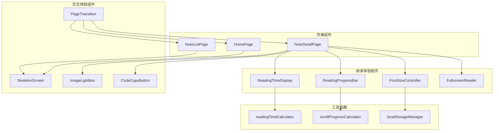

# Design Document

## Overview

本设计文档描述了个人技术博客网站的阅读体验和交互体验优化功能的技术实现方案。主要包括 8 个功能模块：阅读进度条、阅读时间计算、字体大小调节、全屏阅读模式、页面切换动画、骨架屏加载、图片放大预览和代码块复制。

这些功能将通过 Vue 3 Composition API 实现，采用组件化设计，确保代码可复用性和可维护性。

## Architecture



## Components and Interfaces

### 1. ReadingProgressBar 组件

```typescript
// src/components/ReadingProgressBar.vue
interface ReadingProgressBarProps {
  // 无需 props，组件自动监听滚动
}

interface ReadingProgressBarState {
  progress: number  // 0-100
}

// 暴露方法
interface ReadingProgressBarExpose {
  reset(): void
}
```

### 2. FontSizeController 组件

```typescript
// src/components/FontSizeController.vue
interface FontSizeControllerProps {
  // 无需 props
}

interface FontSizeControllerEmits {
  (e: 'change', size: number): void
}

// 常量
const MIN_FONT_SIZE = 12
const MAX_FONT_SIZE = 24
const DEFAULT_FONT_SIZE = 16
const FONT_SIZE_STEP = 2
const STORAGE_KEY = 'article-font-size'
```

### 3. FullscreenReader 组件

```typescript
// src/components/FullscreenReader.vue
interface FullscreenReaderProps {
  // 无需 props，通过 provide/inject 或事件通信
}

interface FullscreenReaderState {
  isFullscreen: boolean
}

interface FullscreenReaderEmits {
  (e: 'enter'): void
  (e: 'exit'): void
}
```

### 4. ImageLightbox 组件

```typescript
// src/components/ImageLightbox.vue
interface ImageLightboxProps {
  // 无需 props，通过事件触发
}

interface ImageLightboxState {
  isOpen: boolean
  currentImage: string | null
  naturalWidth: number
  naturalHeight: number
}
```

### 5. SkeletonScreen 组件

```typescript
// src/components/SkeletonScreen.vue
interface SkeletonScreenProps {
  type: 'article' | 'card' | 'list'
  count?: number  // 用于列表类型，默认 1
}
```

### 6. CodeCopyButton 功能

```typescript
// 集成到 MarkdownRenderer 组件中
interface CopyState {
  status: 'idle' | 'success' | 'error'
  message?: string
}
```

### 7. 工具函数接口

```typescript
// src/utils/readingTime.js
function calculateReadingTime(content: string): number
function countWords(text: string): number
function countCodeCharacters(content: string): number

// src/utils/scrollProgress.js
function calculateScrollProgress(
  scrollTop: number,
  scrollHeight: number,
  clientHeight: number
): number

// src/utils/localStorage.js
function getFontSize(): number
function setFontSize(size: number): void
```

## Data Models

### 阅读时间计算模型

```typescript
interface ReadingTimeConfig {
  wordsPerMinute: number      // 中文阅读速度，默认 200
  codeCharsPerMinute: number  // 代码阅读速度，默认 100
  minReadingTime: number      // 最小显示时间，默认 1
}

interface ReadingTimeResult {
  minutes: number
  wordCount: number
  codeCharCount: number
}
```

### 字体大小配置模型

```typescript
interface FontSizeConfig {
  min: number      // 12
  max: number      // 24
  default: number  // 16
  step: number     // 2
}
```

### 图片灯箱状态模型

```typescript
interface LightboxState {
  isOpen: boolean
  imageSrc: string | null
  imageAlt: string
  displayWidth: number
  displayHeight: number
}
```

## Correctness Properties

*A property is a characteristic or behavior that should hold true across all valid executions of a system-essentially, a formal statement about what the system should do. Properties serve as the bridge between human-readable specifications and machine-verifiable correctness guarantees.*

### Property 1: Scroll progress percentage calculation

*For any* scroll position (scrollTop), document height (scrollHeight), and viewport height (clientHeight), the calculated progress percentage SHALL equal `Math.min(100, Math.max(0, (scrollTop / (scrollHeight - clientHeight)) * 100))`, ensuring the result is always between 0 and 100 inclusive.

**Validates: Requirements 1.1, 1.2**

### Property 2: Reading time calculation

*For any* article content string, the calculated reading time SHALL equal `Math.max(1, Math.ceil((regularTextLength / 200) + (codeCharacterCount / 100)))` minutes, where regularTextLength is the character count excluding code blocks and codeCharacterCount is the total characters within code blocks.

**Validates: Requirements 2.1, 2.2, 2.3**

### Property 3: Font size adjustment bounds

*For any* current font size value and adjustment operation (increase or decrease), the resulting font size SHALL be within the range [12, 24] pixels. Specifically: `increase(size) = Math.min(size + 2, 24)` and `decrease(size) = Math.max(size - 2, 12)`.

**Validates: Requirements 3.1, 3.2**

### Property 4: Font size persistence round-trip

*For any* valid font size value (12-24), saving to localStorage and then retrieving SHALL return the exact same value. This ensures `getFontSize() === size` after `setFontSize(size)` is called.

**Validates: Requirements 3.3, 3.4**

### Property 5: Image lightbox sizing calculation

*For any* image with natural dimensions (naturalWidth, naturalHeight) and viewport dimensions (viewportWidth, viewportHeight), the displayed image dimensions SHALL not exceed 90% of the viewport while maintaining aspect ratio. The calculation: `scale = Math.min(1, (viewportWidth * 0.9) / naturalWidth, (viewportHeight * 0.9) / naturalHeight)`.

**Validates: Requirements 7.5**

## Error Handling

### 1. 滚动进度计算

- 当 `scrollHeight - clientHeight <= 0` 时，返回 0（防止除零错误）
- 确保返回值始终在 0-100 范围内

### 2. 阅读时间计算

- 空内容返回最小值 1 分钟
- 处理特殊字符和 emoji

### 3. 字体大小控制

- localStorage 不可用时使用默认值
- 读取到无效值时重置为默认值

### 4. 图片灯箱

- 图片加载失败时显示错误提示
- 处理图片 URL 无效的情况

### 5. 代码复制

- Clipboard API 不可用时降级使用 `document.execCommand`
- 复制失败时显示错误提示

## Testing Strategy

### 单元测试

使用 Vitest 进行单元测试，覆盖以下场景：

1. **工具函数测试**
   - `calculateScrollProgress` 边界值测试
   - `calculateReadingTime` 各种内容类型测试
   - `getFontSize/setFontSize` localStorage 交互测试

2. **组件测试**
   - FontSizeController 状态变化测试
   - ImageLightbox 打开/关闭状态测试

### 属性测试

使用 fast-check 进行属性测试，验证正确性属性：

1. **Property 1**: 滚动进度计算
   - 生成随机的 scrollTop, scrollHeight, clientHeight
   - 验证结果始终在 [0, 100] 范围内

2. **Property 2**: 阅读时间计算
   - 生成随机文本内容（包含/不包含代码块）
   - 验证计算结果符合公式

3. **Property 3**: 字体大小边界
   - 生成随机初始字体大小
   - 验证增减操作后结果在 [12, 24] 范围内

4. **Property 4**: 字体大小持久化
   - 生成随机有效字体大小
   - 验证存储后读取值相等

5. **Property 5**: 图片尺寸计算
   - 生成随机图片尺寸和视口尺寸
   - 验证显示尺寸不超过视口 90%

### 测试配置

```javascript
// vitest.config.js
export default {
  test: {
    environment: 'jsdom',
    globals: true,
    coverage: {
      reporter: ['text', 'json', 'html']
    }
  }
}
```

属性测试应配置至少 100 次迭代以确保覆盖边界情况。
