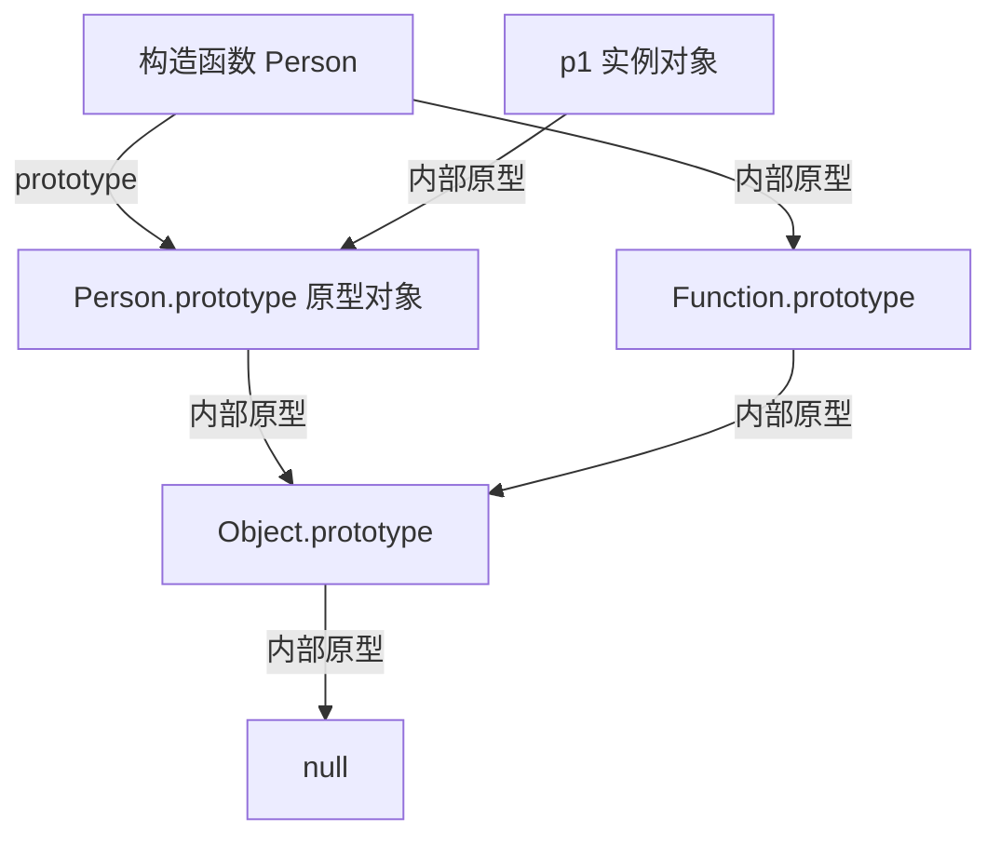
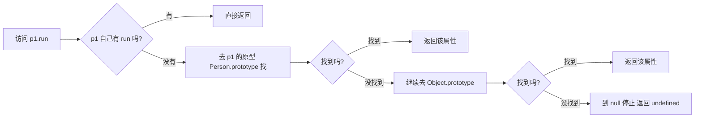
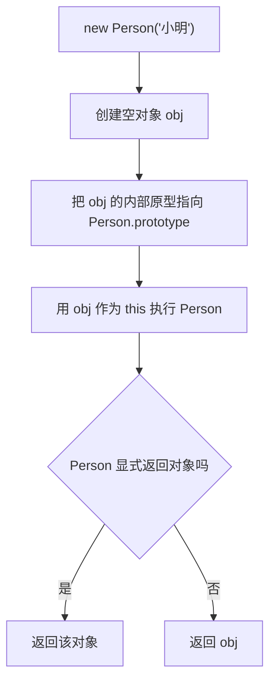
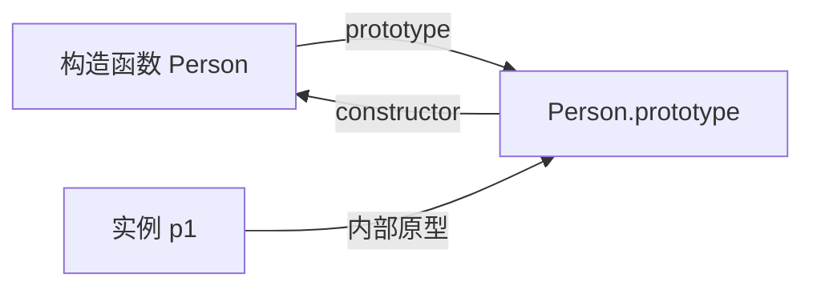

# 第06篇：JavaScript 原型链（图解 + 小白版）

这版目标很明确：

1. 先看图，先有整体感
2. 再看概念，不死记硬背
3. 每个结论都能用代码验证

## 0. 先看三张图（你要的图在这里）

### 图1：构造函数、原型对象、实例对象的关系



图里写的“内部原型”，对应规范里的 `[[Prototype]]`，平时常见旧写法是 `__proto__`。

如果你的 Markdown 环境不渲染 Mermaid，就看 ASCII 图：

```text
构造函数 Person
  ├─ prototype ───────────────> Person.prototype
  └─ [[Prototype]](常见写法 __proto__) -> Function.prototype

实例 p1 = new Person()
  └─ [[Prototype]] ───────────> Person.prototype

向上继续
Person.prototype -> Object.prototype -> null
```

### 图2：读取属性时，原型链怎么查找



### 图3：`new` 调用背后做了什么



## 1. 先把 4 个关键词分开（这是理解关键）

### 1.1 `prototype` 是“函数身上的属性”

白话：

- `prototype` 在“函数对象”上
- 它是给“将来 new 出来的实例”准备的共享区域
- 普通对象一般没有这个属性

```javascript
function Person(name) {
  this.name = name
}

const obj = {}

console.log(typeof Person.prototype) // object
console.log(obj.prototype) // undefined
```

### 1.2 `[[Prototype]]` 是“对象内部指针”

白话：

- 每个对象内部都有一个“向上链接”
- JS 查属性时，会沿这个链接往上找
- 标准读取方式是 `Object.getPrototypeOf`

```javascript
const p1 = new Person('张三')
console.log(Object.getPrototypeOf(p1) === Person.prototype) // true
```

### 1.3 `__proto__` 是历史写法（能用但不推荐主用）

白话：

- 你在教程里经常看到 `obj.__proto__`
- 它多数环境可用，但更推荐标准 API

```javascript
console.log(p1.__proto__ === Person.prototype) // 常见环境 true
console.log(Object.getPrototypeOf(p1) === Person.prototype) // 推荐
```

### 1.4 `constructor` 是原型对象上的“回指”

白话：

- 默认情况下：`Person.prototype.constructor === Person`
- 它像一根“回头箭头”，从原型对象指回它对应的构造函数
- 你可以把它理解成你说的那个“小三角关系”里的最后一条边
- 但你“整块重写 prototype”后，这个关系可能丢失

### `constructor` 的小三角关系图



如果 Mermaid 不显示，就看这个：

```text
          prototype
Person --------------> Person.prototype
  ^                         ^
  |                         |
  | constructor             | 内部原型
  |                         |
  +-------------------------+
             p1
```

这个图要这样记：

1. `Person.prototype` 是构造函数 `Person` 提供给实例共享的原型对象
2. `p1` 通过内部原型连到 `Person.prototype`
3. `Person.prototype` 又通过 `constructor` 指回 `Person`

所以你可以看到一个“绕一圈又回来”的关系：

```javascript
function Person() {}
const p1 = new Person()

console.log(Person.prototype.constructor === Person) // true
console.log(Object.getPrototypeOf(p1) === Person.prototype) // true
console.log(p1.constructor === Person) // true
```

注意最后一行虽然是 `true`，但它不是因为 `p1` 自己有 `constructor`，而是因为：

1. 先查 `p1.constructor`
2. `p1` 自己没有
3. 去 `Person.prototype` 上找
4. 在 `Person.prototype.constructor` 找到了 `Person`

```javascript
function A() {}
A.prototype = {
  say() {
    return 'hi'
  }
}

const a = new A()
console.log(a.constructor === A) // false（通常变成 Object）
```

如果你确实要整体重写，记得补回 `constructor`：

```javascript
A.prototype = {
  constructor: A,
  say() {
    return 'hi'
  }
}
```

这里再补一个非常容易考的点：

- `p1.constructor === Person` 常常成立，但不要把它当成“绝对可靠判断类型”的方式
- 更稳的是：
- 看原型：`Object.getPrototypeOf(p1) === Person.prototype`
- 或用：`p1 instanceof Person`

## 2. 一个最小例子，把关系一次看懂

```javascript
function Person(name) {
  this.name = name
}

Person.prototype.say = function () {
  return `你好，我是${this.name}`
}

const p1 = new Person('小明')

console.log(p1.name) // 自身属性
console.log(p1.say()) // 来自原型
```

这段代码里：

1. `name` 在实例自身
2. `say` 在 `Person.prototype`
3. `p1` 能调用 `say`，是因为 `p1.[[Prototype]] -> Person.prototype`

## 3. JS 查属性时的真实步骤（小白必会）

访问 `p1.xxx` 时：

1. 先看 `p1` 自己有没有 `xxx`
2. 没有就看 `Object.getPrototypeOf(p1)`（通常是 `Person.prototype`）
3. 还没有就继续向上到 `Object.prototype`
4. 再向上是 `null`，停止，结果 `undefined`

```javascript
function Person() {}
Person.prototype.run = function () {
  return 'run'
}

const p1 = new Person()

console.log(p1.run) // function
console.log(p1.toString) // 来自 Object.prototype
console.log(p1.notExist) // undefined
```

## 4. `new` 到底做了什么（建议背下来）

`new Person('小明')` 大致等于：

1. 创建一个空对象 `obj`
2. `obj.[[Prototype]] = Person.prototype`
3. 执行 `Person.call(obj, '小明')`
4. 如果 Person 返回对象，用返回对象
5. 否则返回 `obj`

示例：

```javascript
function Person(name) {
  this.name = name
}

const p1 = new Person('小明')
console.log(p1.name) // 小明
```

特殊点：构造函数显式返回对象时

```javascript
function Test() {
  this.a = 1
  return { b: 2 }
}

const t = new Test()
console.log(t.a) // undefined
console.log(t.b) // 2
```

## 5. 为什么方法放原型上更省内存

### 写在构造函数里（每个实例一份）

```javascript
function User(name) {
  this.name = name
  this.say = function () {
    return this.name
  }
}

const u1 = new User('A')
const u2 = new User('B')
console.log(u1.say === u2.say) // false
```

### 写在原型上（所有实例共享一份）

```javascript
function User2(name) {
  this.name = name
}

User2.prototype.say = function () {
  return this.name
}

const x1 = new User2('A')
const x2 = new User2('B')
console.log(x1.say === x2.say) // true
```

结论：

- 不需要“每个实例都不一样”的方法，优先放原型上

## 6. `instanceof` 本质是什么

`obj instanceof Fn` 判断的是：`Fn.prototype` 是否出现在 `obj` 的原型链上。

```javascript
function Person() {}
const p1 = new Person()

console.log(p1 instanceof Person) // true
console.log(p1 instanceof Object) // true
console.log([] instanceof Array) // true
console.log([] instanceof Object) // true
```

手写一个简化版：

```javascript
function myInstanceof(obj, Fn) {
  if (obj == null || (typeof obj !== 'object' && typeof obj !== 'function')) {
    return false
  }

  let proto = Object.getPrototypeOf(obj)

  while (proto !== null) {
    if (proto === Fn.prototype) return true
    proto = Object.getPrototypeOf(proto)
  }

  return false
}
```

## 7. `class` 和原型链的关系

白话：

- `class` 不是新机制
- 它是“更好写”的语法糖
- 底层仍然是构造函数 + 原型链

```javascript
class Animal {
  speak() {
    return '...'
  }
}

const a = new Animal()

console.log(typeof Animal) // function
console.log(Object.getPrototypeOf(a) === Animal.prototype) // true
```

## 8. 最常见 6 个误区（考试/面试高频）

1. 误区：所有对象都有 `prototype`  
更正：普通对象通常没有，函数才有。

2. 误区：实例通过 `prototype` 找原型  
更正：实例通过 `[[Prototype]]`（常见 `__proto__`）找原型。

3. 误区：`__proto__` 是标准首选  
更正：工程上优先 `Object.getPrototypeOf`。

4. 误区：`constructor` 永远可靠  
更正：重写 `prototype` 后可能失真。

5. 误区：`instanceof` 看“构造函数名”  
更正：它看的是“原型链上是否出现 `Fn.prototype`”。

6. 误区：`class` 就不是原型链了  
更正：`class` 只是写法变了，底层机制没变。

## 9. 一次性自测（建议你亲手跑一遍）

```javascript
function Person() {}
const p1 = new Person()

console.log(Object.getPrototypeOf(p1) === Person.prototype) // true
console.log(Person.prototype.constructor === Person) // true（默认）
console.log(Object.getPrototypeOf(Person.prototype) === Object.prototype) // true
console.log(Object.getPrototypeOf(Object.prototype) === null) // true
console.log(Object.getPrototypeOf(Person) === Function.prototype) // true
console.log(Object.getPrototypeOf(Function.prototype) === Object.prototype) // true
console.log(p1 instanceof Person) // true
console.log(p1 instanceof Object) // true
```

## 10. 最后给你一套“背诵版”

1. `prototype` 属于函数
2. `[[Prototype]]` 属于对象
3. 对象取属性：先自己，后原型链
4. 原型链尽头：`Object.prototype -> null`
5. `instanceof`：看 `Fn.prototype` 在不在链上
6. `class`：语法糖，底层还是原型链

## 参考资料（权威）

- MDN: Inheritance and the prototype chain  
  https://developer.mozilla.org/en-US/docs/Web/JavaScript/Inheritance_and_the_prototype_chain
- MDN: Object.getPrototypeOf()  
  https://developer.mozilla.org/en-US/docs/Web/JavaScript/Reference/Global_Objects/Object/getPrototypeOf
- MDN: Object.prototype.__proto__  
  https://developer.mozilla.org/en-US/docs/Web/JavaScript/Reference/Global_Objects/Object/proto
