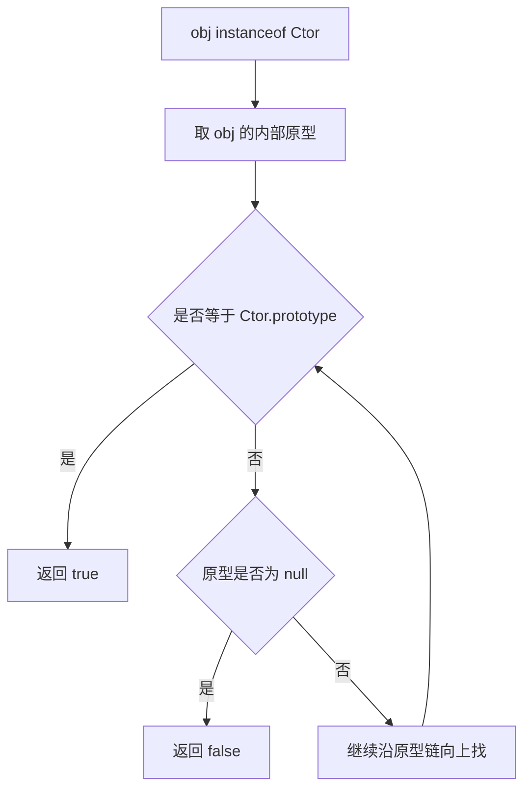
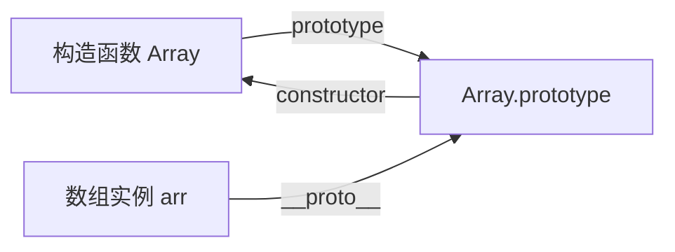
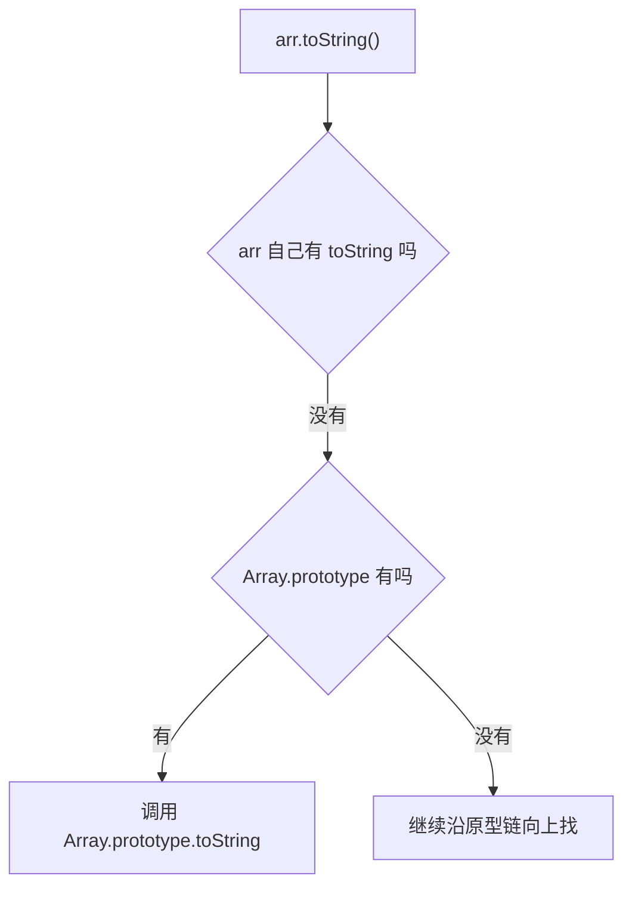

# 08_类型检测与原型链深度解析

这一篇的目标不是只背一句“类型检测用 `Object.prototype.toString.call()`”，而是要真正回答下面两个问题：

1. 为什么它通常比 `typeof`、`instanceof`、`constructor` 更稳？
2. 如果面试官追问“那其他方法为什么不行，缺点到底是什么”，你能不能说清楚？

---

## 一、先记住结论

如果只先背一句，先记这个：

```plain
判断基础类型优先看 typeof；
判断是不是数组优先看 Array.isArray()；
想拿到更细、更通用的类型结果，优先看 Object.prototype.toString.call(value)；
instanceof 判断的是原型链归属，不是底层精确类型；
constructor 只能辅助看，不能单独当最终答案。
```

这五句话是整篇的骨架。

---

## 二、为什么“类型检测”和“原型链”会放在一起讲

因为很多类型判断，本质上都和“对象从哪条原型链继承而来”有关。

比如：

- `instanceof` 本质就是沿着对象的原型链往上找
- `constructor` 也是通过原型对象上的属性间接回指构造函数
- `Array.isArray()` 虽然不是直接查原型链，但它解决的正是“只看原型链容易翻车”的问题
- `Object.prototype.toString.call()` 看起来像普通方法调用，背后其实也和对象内部类型标记有关

所以这一篇看似讲“类型检测”，其实是在帮你分清：

- 哪些方法判断的是“值的类别”
- 哪些方法判断的是“构造关系”
- 哪些方法判断的是“原型链归属”

这三件事不是一回事。

---

## 三、先看最常见的几种类型检测方案

### 3.1 `typeof`

```javascript
typeof 123           // 'number'
typeof 'abc'         // 'string'
typeof true          // 'boolean'
typeof undefined     // 'undefined'
typeof function () {} // 'function'
typeof {}            // 'object'
typeof []            // 'object'
typeof null          // 'object'
```

它的优点：

- 语法最简单
- 判断基础类型很快
- 判断函数也很好用

它的缺点：

- 对对象细分能力很差
- `array`、`object`、`date`、`regexp` 最后大多都只会告诉你 `'object'`
- `null` 会返回 `'object'`，这是历史遗留问题

所以面试里不能说“`typeof` 不行”，更准确的说法应该是：

```plain
typeof 适合判断基础类型和 function，
但不适合细分引用类型，因为除了 function 之外，大多数对象最终都只会得到 object。
```

这句话比“typeof 不准确”更专业。

### 3.2 `instanceof`

```javascript
[] instanceof Array           // true
new Date() instanceof Date    // true
function () {} instanceof Function // true
{} instanceof Object          // true
```

它的本质不是“看名字像不像”，而是：

```plain
检查右侧构造函数的 prototype，
是否出现在左侧对象的原型链上。
```

可以把它理解成下面这个过程：



对应的简化实现：

```javascript
function myInstanceof(obj, Ctor) {
  if (obj == null || (typeof obj !== 'object' && typeof obj !== 'function')) {
    return false
  }

  let proto = Object.getPrototypeOf(obj)

  while (proto) {
    if (proto === Ctor.prototype) {
      return true
    }
    proto = Object.getPrototypeOf(proto)
  }

  return false
}
```

它的优点：

- 非常适合判断“某对象是不是某构造函数/类的实例”
- 能体现继承关系
- 面向对象场景下很好用

它的缺点：

- 它判断的是“原型链关系”，不是“精确类型标签”
- 跨 `iframe`、跨 `window` 时可能失效
- 左侧如果是原始值，通常直接就是 `false`
- 右侧如果原型被改写，结果也可能变化

最经典的翻车点：

```javascript
const iframe = document.createElement('iframe')
document.body.appendChild(iframe)

const otherArray = new iframe.contentWindow.Array()

otherArray instanceof Array // false
Array.isArray(otherArray)   // true
```

为什么会这样？

因为 `otherArray` 的原型链上挂的是“另一个全局环境里的 `Array.prototype`”，不是当前页面这个 `Array.prototype`。

所以面试里更标准的回答是：

```plain
instanceof 适合判断实例归属和继承关系，
但它依赖原型链，跨执行上下文时容易失效，
因此不适合当成通用精确类型判断方案。
```

### 3.3 `constructor`

```javascript
[].constructor === Array          // true
({}).constructor === Object       // true
(new Date()).constructor === Date // true
```

它看起来很好用，但问题非常大。

先看正常关系图：



很多人会误以为：

```plain
既然实例能通过原型链访问到 constructor，
那我就用 constructor 判断类型不就好了？
```

问题在于：`constructor` 只是一个普通属性，它并不是“神圣不可改”的底层标记。

例如：

```javascript
function Person(name) {
  this.name = name
}

Person.prototype = {
  sayHi() {
    return 'hi'
  }
}

const p = new Person('Tom')

console.log(p.constructor === Person) // false
console.log(p.constructor === Object) // true
```

为什么会这样？

因为你整个替换了 `Person.prototype`，新对象里没有默认的 `constructor` 回指了，于是它沿着原型链继续往上找，最后拿到的是 `Object.prototype.constructor`。

它的优点：

- 在默认原型未被改写时，读起来直观
- 可作为调试和辅助判断

它的缺点：

- 太容易被改写
- 自定义原型时容易丢失
- 不能跨团队、跨库、跨复杂场景保证稳定
- 本质不是专门为“可靠类型判断”设计的

所以更专业的说法是：

```plain
constructor 只是原型对象上的普通属性回指，
默认情况下常常能用，
但它可以被覆盖、丢失或指错，
因此只能辅助判断，不能作为可靠的最终类型检测依据。
```

### 3.4 `Array.isArray()`

```javascript
Array.isArray([])           // true
Array.isArray({})           // false
Array.isArray('abc')        // false
Array.isArray(new Array())  // true
```

它的优点非常明确：

- 专门判断数组
- 比 `instanceof Array` 更稳
- 跨 `iframe` 也能正常工作

它的缺点也很明确：

- 只能判断数组
- 它不是“通用类型检测器”

所以如果面试官问“为什么不用 `Array.isArray()` 代替 `toString.call`”，正确回答是：

```plain
因为 Array.isArray 只解决“是不是数组”这一个问题，
它很好，但它不是通用方案。
```

### 3.5 `Object.prototype.toString.call(value)`

这就是这篇真正的主角。

```javascript
Object.prototype.toString.call([])         // '[object Array]'
Object.prototype.toString.call({})         // '[object Object]'
Object.prototype.toString.call(null)       // '[object Null]'
Object.prototype.toString.call(undefined)  // '[object Undefined]'
Object.prototype.toString.call(new Date()) // '[object Date]'
Object.prototype.toString.call(/a/)        // '[object RegExp]'
```

它的核心优势是：

- 可以细分大多数常见内建对象
- 能正确区分 `null`、`undefined`、`array`、`date`、`regexp`
- 不像 `instanceof` 那样过度依赖当前环境里的构造函数引用
- 比 `constructor` 稳得多

所以它常被当作“通用精确类型判断”的主力方案。

---

## 四、为什么一定要写成 `Object.prototype.toString.call(value)`

这个问题是面试高频追问点。

### 4.1 不能随便直接 `value.toString()`

因为很多对象都重写了自己的 `toString`。

例如数组：

```javascript
[1, 2, 3].toString() // '1,2,3'
```

这已经不是“类型标签”了，而是“数组转字符串”的业务行为。

再例如：

```javascript
const obj = {
  toString() {
    return '我是自定义字符串'
  }
}

obj.toString() // '我是自定义字符串'
```

所以如果你直接调实例自己的 `toString()`，拿到的往往不是类型信息。

### 4.2 为什么要借用 `Object.prototype.toString`

因为我们要的不是对象自己重写过的 `toString`，而是 `Object` 原型上那一个“最原始”的版本。

可以把这个过程理解成：

```javascript
const rawToString = Object.prototype.toString
rawToString.call(value)
```

也就是：

- 先把“原始版本的 `toString` 函数”拿出来
- 再用 `.call(value)` 强行指定它内部的 `this`
- 让它对 `value` 做类型标记输出

### 4.3 `.call()` 在这里到底干了什么

`.call()` 的作用不是“帮你走原型链找方法”，而是：

```plain
直接调用某个函数，
并把函数运行时的 this 指向你指定的对象。
```

最小例子：

```javascript
function showThis() {
  console.log(this)
}

showThis.call({ name: '主人' }) // { name: '主人' }
```

放到类型检测里就是：

```javascript
Object.prototype.toString.call([])
```

等价理解为：

```javascript
把 Object.prototype.toString 这个函数拿出来，
然后让它以 [] 作为 this 执行
```

---

## 五、`Object.prototype.toString.call()` 为什么通常更准

因为它输出的不是“这个对象链到了谁”，也不是“这个构造函数名字是什么”，而是一个更稳定的类型标签形式：

```plain
[object Type]
```

常见结果如下：

| 值 | 结果 |
| --- | --- |
| `[]` | `[object Array]` |
| `{}` | `[object Object]` |
| `null` | `[object Null]` |
| `undefined` | `[object Undefined]` |
| `new Date()` | `[object Date]` |
| `/abc/` | `[object RegExp]` |
| `function(){}` | `[object Function]` |
| `new Map()` | `[object Map]` |
| `new Set()` | `[object Set]` |

通常我们会再切一下字符串：

```javascript
function getType(value) {
  return Object.prototype.toString.call(value).slice(8, -1)
}

console.log(getType([]))         // 'Array'
console.log(getType(null))       // 'Null'
console.log(getType(undefined))  // 'Undefined'
console.log(getType(new Date())) // 'Date'
```

---

## 六、但它也不是“绝对无敌”

很多教程会把它说成“最完美方案”，这也不够严谨。

它也有边界。

### 6.1 `Symbol.toStringTag` 可以影响结果

现代 JavaScript 允许对象自定义这个标签：

```javascript
class MyBox {
  get [Symbol.toStringTag]() {
    return 'MyBox'
  }
}

const box = new MyBox()
console.log(Object.prototype.toString.call(box)) // '[object MyBox]'
```

这说明：

```plain
toString.call 的结果通常很稳，
但它并不是完全不可伪装。
```

### 6.2 它拿到的是“类型标签”，不是业务语义

比如：

```javascript
class UserList extends Array {}
const users = new UserList()

Object.prototype.toString.call(users) // 可能仍是 '[object Array]'
```

它能告诉你“它底层像数组”，但未必能表达你业务里“这是用户列表”这种语义身份。

### 6.3 它不总是最简洁

如果你只想判断数组：

```javascript
Array.isArray(value)
```

就比：

```javascript
Object.prototype.toString.call(value) === '[object Array]'
```

更直接、更语义化。

所以真正成熟的说法不是“永远只用 `toString.call`”，而是：

```plain
通用精确判断时优先考虑它，
但在具体单一场景下，也要用更语义化的专用 API。
```

---

## 七、面试官最爱追问的“其他方法为什么不行”，怎么答

这一段主人可以直接背。

### 7.1 简洁版回答

```plain
typeof 适合判断基础类型和 function，但无法细分大多数引用类型，而且 null 会误判为 object；
instanceof 判断的是原型链归属，适合看实例关系，但跨 iframe 可能失效；
constructor 只是普通属性，容易被改写，稳定性不够；
Array.isArray 很适合判断数组，但只能判断数组这一种类型；
所以如果我需要一个更通用、更细粒度的类型判断，通常会用 Object.prototype.toString.call。
```

### 7.2 面试进阶版回答

```plain
我会先区分“判断基础类型”“判断实例关系”“拿精确类型标签”这三类需求。

如果只是判断 number、string、boolean、undefined，typeof 最方便；
如果要判断某对象是不是某个类的实例，instanceof 更合适，因为它查的是原型链；
如果要判断是不是数组，Array.isArray 是最语义化也更稳的方案；
但如果我要做一个通用工具，能准确区分 null、array、date、regexp、map、set 等类型，
那我会优先用 Object.prototype.toString.call，
因为它比 typeof 细，比 constructor 稳，也不像 instanceof 那样过度依赖原型链环境。
```

这段回答的重点在于：

- 不是一棒子打死其他方法
- 而是按场景分工
- 最后自然落到 `toString.call`

这样面试官会觉得你不是“只会背答案”，而是真的理解边界。

---

## 八、原型链在这里到底起了什么作用

虽然 `Object.prototype.toString.call(value)` 自己不是在“沿原型链找匹配的 `prototype`”，但它和原型体系仍然有关系。

### 8.1 平时 `obj.toString()` 为什么会走到原型上

当你写：

```javascript
arr.toString()
```

查找过程是：



也就是说：

- 正常“点方法”调用，会先查对象自身
- 找不到再沿原型链往上找

### 8.2 但 `Object.prototype.toString.call(arr)` 不一样

它不是：

```javascript
arr.toString()
```

而是：

```javascript
const fn = Object.prototype.toString
fn.call(arr)
```

这个过程里：

- `toString` 函数已经明确拿到了
- 不再需要从 `arr` 身上查找方法
- `.call(arr)` 只是指定运行时 `this`

所以这里最容易混淆的地方就是：

```plain
方法“在哪找到”是原型链问题；
函数“执行时 this 指向谁”是 call/apply/bind 问题。
```

主人把这句分开，很多题一下就通了。

---

## 九、写一个实用的通用类型判断工具

```javascript
const rawToString = Object.prototype.toString

export function getType(value) {
  return rawToString.call(value).slice(8, -1).toLowerCase()
}

export function isPlainObject(value) {
  return rawToString.call(value) === '[object Object]'
}

export function isDate(value) {
  return rawToString.call(value) === '[object Date]'
}

export function isRegExp(value) {
  return rawToString.call(value) === '[object RegExp]'
}
```

如果只判断数组，还是建议单独写：

```javascript
export function isArray(value) {
  return Array.isArray(value)
}
```

这样表达更清晰。

---

## 十、做题或面试时的决策顺序

可以直接按这个顺序想：

### 场景 1：判断基础类型

```javascript
typeof value
```

适合：

- `string`
- `number`
- `boolean`
- `undefined`
- `function`
- `symbol`
- `bigint`

### 场景 2：判断是不是数组

```javascript
Array.isArray(value)
```

### 场景 3：判断是不是某个类的实例

```javascript
value instanceof SomeClass
```

### 场景 4：做通用精确类型工具

```javascript
Object.prototype.toString.call(value)
```

---

## 十一、面试高频追问补充

### 11.1 `null` 为什么 `typeof` 是 `'object'`

这是 JavaScript 早期实现里的历史遗留问题，不是因为 `null` 真的是对象。

所以：

```javascript
typeof null // 'object'
```

只能当成历史包袱记住。

### 11.2 `instanceof` 能不能判断基本类型

通常不能。

```javascript
'abc' instanceof String // false
123 instanceof Number   // false
true instanceof Boolean // false
```

因为这些是原始值，不是对应包装对象实例。

但：

```javascript
new String('abc') instanceof String // true
```

这也再次说明：

```plain
instanceof 判断的是实例关系，不是字面值的底层类别。
```

### 11.3 为什么很多库都缓存 `Object.prototype.toString`

比如这样：

```javascript
const toString = Object.prototype.toString
```

原因有两个：

- 少写重复长代码
- 避免对象原型链上某些奇怪改动带来阅读干扰

主要是可读性和复用性，不是说性能会有多夸张的飞跃。

---

## 十二、一张总表彻底对比

| 方法 | 适合什么 | 优点 | 缺点 |
| --- | --- | --- | --- |
| `typeof` | 基础类型、函数 | 简单直接 | 无法细分大多数引用类型，`null` 误判 |
| `instanceof` | 判断实例关系、继承关系 | 能体现原型链归属 | 跨 iframe 可能失效，不适合通用精确判断 |
| `constructor` | 辅助判断 | 直观 | 可被改写、丢失，不可靠 |
| `Array.isArray()` | 判断数组 | 语义清晰，跨环境更稳 | 只能判断数组 |
| `Object.prototype.toString.call()` | 通用精确类型检测 | 细粒度高，覆盖面广 | 写法长，且 `Symbol.toStringTag` 可影响结果 |

---

## 十三、最后给主人一版可直接复述的标准答案

```plain
JavaScript 里没有一种方法适合所有类型检测场景，要看需求。

typeof 适合判断基础类型和 function，
但它不能细分大多数引用类型，而且 null 会返回 object。

instanceof 判断的是原型链上是否能找到构造函数的 prototype，
适合判断实例归属和继承关系，
但跨 iframe 或跨 window 时可能失效。

constructor 本质只是原型对象上的普通属性，
默认情况下可以辅助判断，
但它容易被改写或丢失，所以不够可靠。

Array.isArray 非常适合判断数组，
但它只解决数组这一类问题。

如果我要做一个更通用、更精确的类型判断，
比如区分 null、array、date、regexp、map、set，
我通常会使用 Object.prototype.toString.call(value)。
它不是万能的，但在通用类型检测场景里通常是更稳妥的选择。
```

---

## 十四、记忆口诀

```plain
typeof 看基础，
isArray 看数组，
instanceof 看继承，
constructor 只辅助，
toString.call 看通用精确类型。
```

---

## 十五、自测题

```javascript
console.log(typeof null)
console.log(typeof [])
console.log([] instanceof Array)
console.log(Array.isArray([]))
console.log(Object.prototype.toString.call([]))
console.log(Object.prototype.toString.call(null))
console.log(Object.prototype.toString.call(new Date()))
```

请主人自己先回答结果，再对照：

```javascript
// 'object'
// 'object'
// true
// true
// '[object Array]'
// '[object Null]'
// '[object Date]'
```

如果这些都能顺下来，再把第十三节那段口述出来，这题基本就稳了。
