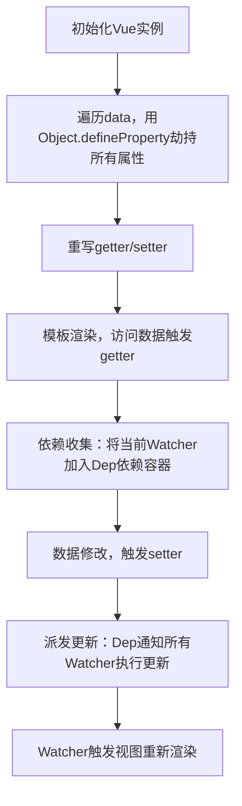

# Vue 响应式原理 超清晰讲解

Vue 的响应式是**核心灵魂**，它让数据变化时，视图能**自动更新**，我们不用手动操作 DOM。

## 一句话总结核心差异

| 版本 | 核心API | 监听范围 | 局限性 |
| :--- | :--- | :--- | :--- |
| Vue2 | `Object.defineProperty` | 只能监听已有属性 | 无法检测新增/删除属性、数组下标修改 |
| Vue3 | `Proxy` + `Reflect` | 代理整个对象 | 无监听盲区，性能更优 |

---

# 第一部分：Vue2 响应式原理

## 一、核心三要素

Vue2 响应式依靠 3 个核心角色：

| 角色 | 作用 |
| :--- | :--- |
| **Observer** | 遍历 data，用 `Object.defineProperty` 劫持属性的 getter/setter，给每个属性创建 Dep |
| **Dep（依赖容器）** | 收集当前属性对应的所有 Watcher，数据变化时通知 Watcher |
| **Watcher** | 视图更新的"执行者"，每个组件/模板用到数据的地方对应一个 Watcher |

## 二、核心流程



## 三、核心逻辑拆解

### 1. 数据劫持
遍历 `data` 中的所有属性，用 `Object.defineProperty()` 重写属性的 `getter` 和 `setter`：

```javascript
Object.defineProperty(对象, '属性名', {
  value: 值,          // 属性值
  writable: true,     // 是否可修改
  enumerable: true,   // 是否可遍历
  configurable: true, // 是否可删除
  get: function() {}, // 获取属性时调用
  set: function(val) {} // 设置属性时调用
});
```

### 2. 依赖收集
当模板渲染（或使用数据）时，触发 `getter`，把用到这个数据的"视图更新函数"（Watcher）收集起来。

### 3. 派发更新
当数据被修改时，触发 `setter`，通知所有收集到的 Watcher 执行更新，从而更新页面。

## 四、手写简化版响应式

这是 Vue2 响应式**最核心的精简版代码**，能直接运行：

```javascript
// 1. Dep：依赖容器，收集Watcher
class Dep {
  constructor() {
    this.subs = []; // 存储所有依赖的Watcher
  }

  // 添加Watcher
  addSub(watcher) {
    this.subs.push(watcher);
  }

  // 通知所有Watcher更新
  notify() {
    this.subs.forEach(watcher => watcher.update());
  }
}

// 2. Watcher：视图更新执行者
class Watcher {
  constructor(cb) {
    this.cb = cb; // 回调函数（更新视图的逻辑）
    Dep.target = this; // 把当前Watcher标记为"正在收集的目标"
  }

  // 执行更新
  update() {
    this.cb();
  }
}

// 3. Observer：劫持data的属性
function observer(data) {
  if (typeof data !== 'object' || data === null) return;

  // 遍历对象的所有属性
  Object.keys(data).forEach(key => {
    let value = data[key];
    const dep = new Dep(); // 给每个属性创建一个Dep

    // 递归劫持子属性（比如data里的对象）
    observer(value);

    // 劫持getter/setter
    Object.defineProperty(data, key, {
      enumerable: true,
      configurable: true,
      // 访问属性时触发getter（收集依赖）
      get() {
        // 如果有正在收集的Watcher，就加入Dep
        if (Dep.target) {
          dep.addSub(Dep.target);
        }
        return value;
      },
      // 修改属性时触发setter（派发更新）
      set(newValue) {
        if (newValue === value) return;
        value = newValue;
        observer(newValue); // 新值如果是对象，也要劫持
        dep.notify(); // 通知所有Watcher更新
      }
    });
  });
}

// 测试代码
const data = { name: '张三', age: 20 };

// 1. 劫持data的属性
observer(data);

// 2. 创建Watcher（模拟视图更新）
new Watcher(() => {
  console.log('视图更新：name=', data.name, 'age=', data.age);
});

// 3. 访问数据（触发getter，收集依赖）
console.log('初始数据：', data.name, data.age); // 触发getter，Watcher被收集到Dep

// 4. 修改数据（触发setter，派发更新）
data.name = '李四'; // 输出：视图更新：name= 李四 age= 20
data.age = 21;     // 输出：视图更新：name= 李四 age= 21
```

#### 代码解释
1. **Observer**：遍历`data`的每个属性，用`Object.defineProperty`重写`get`和`set`；
2. **getter**：访问属性时，把当前的`Watcher`（视图更新函数）加入`Dep`；
3. **setter**：修改属性时，调用`Dep`的`notify`方法，通知所有`Watcher`执行`update`（更新视图）；
4. **测试效果**：修改`data.name`或`data.age`时，会自动触发"视图更新"的回调，这就是Vue2响应式的核心逻辑。

## 五、Vue2 响应式的局限性

正因为基于 `Object.defineProperty`，Vue2 的响应式有几个天然缺陷，这也是 Vue3 改用 Proxy 的原因：

### 1. 无法检测对象新增/删除属性

```javascript
const vm = new Vue({
  data() {
    return { user: { name: '张三' } }
  }
});
// ❌ 新增属性无法响应式
vm.user.age = 20;
// ❌ 删除属性无法响应式
delete vm.user.name;
// ✅ 必须用 Vue.set / Vue.delete
Vue.set(vm.user, 'age', 20);
Vue.delete(vm.user, 'name');
```

**原因**：Vue2 初始化时，只对 `data` 中**已存在的属性**劫持了 getter/setter；新增/删除的属性没有被劫持，自然触发不了 setter。

### 2. 无法检测数组下标/长度修改

```javascript
const vm = new Vue({
  data() {
    return { list: [1, 2, 3] }
  }
});
// ❌ 下标修改无响应
vm.list[0] = 100;
// ❌ 长度修改无响应
vm.list.length = 2;
// ✅ 必须用数组的变异方法（push/pop/splice等，Vue已重写）
vm.list.splice(0, 1, 100);
```

**原因**：Vue2 为了性能，没有对数组的每一个索引做 getter/setter 劫持。

### 3. 深度劫持需要递归

对嵌套较深的对象，递归劫持会有一定性能开销。

## 六、Vue2 局限性的解决方案

### 1. 解决对象更新问题

```javascript
// ✅ 新增响应式属性
this.$set(this.user, 'age', 20);
// ✅ 删除响应式属性
this.$delete(this.user, 'name');
// ✅ 替换整个对象（推荐简单场景）
this.user = { ...this.user, age: 20 };
```

### 2. 解决数组更新问题

Vue2 重写了数组的 7 个**变异方法**，调用这些方法会自动触发响应式更新：

| 方法名 | 作用 | 示例 |
| :--- | :--- | :--- |
| push | 尾部添加元素 | `this.list.push(4)` |
| pop | 尾部删除元素 | `this.list.pop()` |
| shift | 头部删除元素 | `this.list.shift()` |
| unshift | 头部添加元素 | `this.list.unshift(0)` |
| splice | 增/删/改元素（万能） | `this.list.splice(0, 1, 100)` |
| sort | 排序 | `this.list.sort()` |
| reverse | 反转数组 | `this.list.reverse()` |

**重点**：`splice` 是解决数组索引修改的万能方法：

```javascript
// ✅ 替换索引0的元素
this.list.splice(0, 1, 100);
// ✅ 修改数组长度为2
this.list.splice(2);
```

---

# 第二部分：Vue3 响应式原理

Vue3 对响应式系统进行了重构，引入 ES6 的 `Proxy` 和 `Reflect` API，解决了 Vue2 的所有问题。

## 一、核心公式

**Vue3 响应式 = Proxy 拦截 + Reflect 反射 + track 收集依赖 + trigger 触发更新**

## 二、核心三要素

Vue3 响应式只靠 3 个东西：

1. **Proxy**：代理对象，拦截数据操作
2. **track**（收集依赖）：数据被读时，记录"谁用到了我"
3. **trigger**（触发更新）：数据被改时，通知"用到我的人更新"

## 三、Proxy 与 Reflect 核心概念

### 1. Proxy（代理）

`Proxy` 可以理解为一个中间层，它能够拦截并自定义对象上各种操作的行为。

```javascript
// 语法：new Proxy(原始对象, { 拦截配置 })
const proxyData = new Proxy(data, {
  get(target, prop, receiver) {},    // 拦截「读取属性」
  set(target, prop, value, receiver) {}, // 拦截「修改/新增属性」
  deleteProperty(target, prop) {} // 拦截「删除属性」
});
```

**核心特点**：
- ✅ 代理**整个对象**，不是单个属性
- ✅ 能拦截新增/删除属性、数组下标修改
- ✅ 操作的是"代理对象"，原始对象被保护

### 2. Reflect（反射）

`Reflect` 是对象操作的"标准工具人"，与 Proxy 配对使用。

```javascript
Reflect.get(target, prop); // 读取属性
Reflect.set(target, prop, value); // 设置属性
Reflect.deleteProperty(target, prop); // 删除属性
```

**核心特点**：
- ✅ 所有方法返回布尔值，能判断操作是否成功
- ✅ 处理边界情况更安全（如只读属性、原型链）
- ✅ 与 Proxy 拦截器参数完全对齐

### 3. 为什么必须用 Reflect？

| 对比项 | 传统写法 `target[key]` | Reflect 写法 |
| :--- | :--- | :--- |
| 返回值 | 无返回值，失败静默 | 返回布尔值，明确成功/失败 |
| this 指向 | 可能丢失 | 通过 receiver 参数保证正确 |
| 原型链/Getter | 可能出 bug | 完美处理 |

**示例对比**：

```javascript
const obj = { name: '张三' };

// ❌ 传统写法：修改失败无提示
obj.name = '李四';

// ✅ Reflect 写法：能判断是否成功
const isOk = Reflect.set(obj, 'name', '李四');
console.log(isOk); // true

// 处理只读属性
Object.defineProperty(obj, 'age', { value: 20, writable: false });
const isOk2 = Reflect.set(obj, 'age', 21);
console.log(isOk2); // false（修改失败，明确提示）
```

## 四、Vue3 响应式完整核心代码

这是**最标准、最接近 Vue3 源码、可直接运行**的完整响应式代码：

```javascript
// ==================== 1. 依赖存储容器 ====================
// 结构：WeakMap = { 目标对象: Map{ 属性名: Set[副作用函数] } }
const targetMap = new WeakMap();
let activeEffect = null;

// ==================== 2. 收集依赖 track ====================
function track(target, key) {
  if (!activeEffect) return;

  let depsMap = targetMap.get(target);
  if (!depsMap) {
    targetMap.set(target, (depsMap = new Map()));
  }

  let dep = depsMap.get(key);
  if (!dep) {
    depsMap.set(key, (dep = new Set()));
  }

  dep.add(activeEffect);
}

// ==================== 3. 触发更新 trigger ====================
function trigger(target, key) {
  const depsMap = targetMap.get(target);
  if (!depsMap) return;

  const dep = depsMap.get(key);
  if (dep) {
    dep.forEach(effect => effect());
  }
}

// ==================== 4. 响应式实现（Proxy + Reflect） ====================
function reactive(target) {
  return new Proxy(target, {
    get(target, key, receiver) {
      // ✅ Reflect 正确取值 + 保证 this 指向
      const result = Reflect.get(target, key, receiver);
      track(target, key); // 收集依赖
      return result;
    },
    set(target, key, value, receiver) {
      // ✅ Reflect 正确赋值 + 返回布尔值
      const success = Reflect.set(target, key, value, receiver);
      trigger(target, key); // 触发更新
      return success;
    },
    deleteProperty(target, key) {
      const success = Reflect.deleteProperty(target, key);
      trigger(target, key);
      return success;
    }
  });
}

// ==================== 5. 副作用函数 ====================
function effect(fn) {
  activeEffect = fn;
  fn(); // 执行时自动读取数据 → 收集依赖
  activeEffect = null;
}
```

### 测试效果

```javascript
// 1. 创建响应式对象
const state = reactive({
  name: '小明',
  age: 18
});

// 2. 模拟视图渲染（依赖收集）
effect(() => {
  console.log('视图更新 →', '姓名：', state.name, '年龄：', state.age);
});

// 3. 修改数据 → 自动触发视图更新
state.name = '小红';
state.age = 20;

// 输出：
// 视图更新 → 姓名：小明 年龄：18
// 视图更新 → 姓名：小红 年龄：18
// 视图更新 → 姓名：小红 年龄：20
```

## 五、ref 与 reactive 的区别

| **API** | **适用类型** | **实现原理** | **使用注意** |
| :--- | :--- | :--- | :--- |
| `ref` | 基本类型 + 对象 | 内部通过 `value` 属性包装，基本类型用**类的 getter/setter**，对象内部转 `reactive` | 需通过 `.value` 访问/修改值 |
| `reactive` | 对象 / 数组 | 直接用 `Proxy` 代理整个对象（懒代理） | 不能直接替换整个对象，否则丢失响应式 |

### ref 实现原理

```javascript
const count = ref(0);

count.value++; // 修改值会触发 setter，派发更新
console.log(count.value); // 读取值会触发 getter，依赖收集

// ref 的简化实现原理
class RefImpl {
  constructor(value) {
    this._value = value;
  }
  get value() {
    track(this, 'value');
    return this._value;
  }
  set value(newVal) {
    this._value = newVal;
    trigger(this, 'value');
  }
}
```

### reactive 实现原理

```javascript
const state = reactive({
  count: 0,
  info: { name: 'Vue' }
});

state.count++; // 修改值会触发 Proxy 的 set 拦截
state.info.name = 'Vue 3'; // 深层次修改也会触发响应式更新
```

**懒代理策略**：Vue3 只有在访问嵌套对象时才会递归代理，性能优于 Vue2 的初始化递归劫持。

## 六、Vue3 响应式优势总结

| **对比项** | **Vue2** | **Vue3** |
| :--- | :--- | :--- |
| 监听范围 | 仅已存在的属性 | 整个对象，包括新增/删除属性 |
| 数组支持 | 需用变异方法 | 直接修改下标/长度即可 |
| 性能 | 初始化递归劫持，大对象开销大 | 懒代理（按需递归），性能更优 |
| API 复杂度 | 需额外记忆 `Vue.set` 等 | 直接赋值，符合原生 JS 习惯 |
| TS 支持 | 一般 | 类型推导更完善 |

## 七、边界情况：替换整个响应式对象

### Vue2 为什么替换整个对象反而能生效？

- **Vue2**：响应式是劫持 `data` 里的**属性**，如果替换整个 `this.user = { ... }`，本质是修改 `this` 上的 `user` 属性（这个属性早已被劫持），所以能触发更新
- **Vue3**：响应式是代理**整个对象**，如果替换整个代理对象，相当于变量指向了新的普通对象，原 Proxy 外壳直接被抛弃

### Vue3 解决方案

#### 1. 用 `reactive` 时：不直接替换对象，只改属性

```javascript
import { reactive } from 'vue'

const state = reactive({
  info: { name: '张三' } // 包一层，外层不替换
})

// ✅ 替换内层，响应式生效
state.info = { name: '王五' }

// ❌ 错误：直接替换整个 reactive 对象
// state = { name: '王五' }
```

#### 2. 优先用 `ref`：专为「整体替换」场景设计

```javascript
import { ref } from 'vue'

const user = ref({ name: '张三' })

// ✅ 整体替换对象，响应式不丢
user.value = { name: '王五' }
```

---

# 总结

## Vue2 核心要点

1. Vue2 响应式核心是 **Object.defineProperty()**，通过劫持 `data` 属性的 getter/setter 实现依赖收集和派发更新
2. 核心三角色：`Observer`（劫持数据）、`Dep`（收集依赖）、`Watcher`（更新视图）
3. 局限性：无法检测对象新增/删除属性、数组下标/长度修改，需用 `Vue.set` / 数组变异方法解决

## Vue3 核心要点

1. Vue3 响应式核心是 **Proxy + Reflect**，代理整个对象，无监听盲区
2. 核心公式：**Proxy 拦截 + Reflect 反射 + track 收集依赖 + trigger 触发更新**
3. Proxy 负责"拦"，Reflect 负责"做"，两者配对使用保证了正确性和安全性
4. `ref` 适合可能整体替换的场景，`reactive` 适合不整体替换的对象

## 一句话记住

- **Vue2**：`Object.defineProperty` → 逐个属性劫持 → 有局限性，需特殊 API 补救
- **Vue3**：`Proxy` + `Reflect` → 全对象代理 → 无监听盲区，性能更优，API 更简洁
