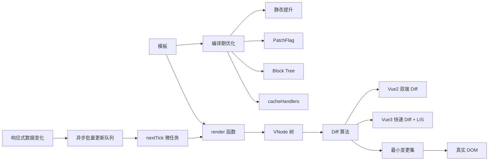

# 第13篇：虚拟DOM、Diff、编译优化与面试高频补充

> 本篇是对前 12 篇的"原理深度补全"。
> 面试官区分"会用 Vue"和"懂 Vue"的核心问题，几乎都集中在这里。
> 阅读建议：建议在掌握第03篇响应式原理之后再读本篇。

---

## 一、虚拟 DOM（Virtual DOM）

### 1.1 是什么

**虚拟 DOM = 用普通 JS 对象描述真实 DOM 结构。**

```javascript
// 真实 DOM
// <div class="box" id="app">hello</div>

// 对应的虚拟 DOM（VNode）
const vnode = {
  tag: 'div',
  props: { class: 'box', id: 'app' },
  children: 'hello'
}
```

Vue 内部用 `h(tag, props, children)` 函数（即 `createVNode`）创建 VNode，模板编译后的 `render` 函数返回的就是 VNode 树。

### 1.2 为什么需要虚拟 DOM

常见误解："虚拟 DOM 一定比直接操作 DOM 快"——**错**。

真正的好处有 3 条：

| 原因 | 说明 |
| --- | --- |
| **跨平台能力** | VNode 是纯 JS 对象，可以渲染到浏览器 DOM、SSR 字符串、Weex/小程序、Canvas 等 |
| **批量 + 最小化操作** | 数据变化时先在 JS 层 Diff 出最小变更集，再统一更新真实 DOM，避免频繁回流重绘 |
| **声明式开发** | 开发者只描述"应该是什么样"，框架负责"如何变到这一样"，心智负担小 |

### 1.3 虚拟 DOM vs 直接操作 DOM 的性能对比

- **极少量、明确的 DOM 操作**：手写原生更快（虚拟 DOM 有 Diff 开销）
- **大量、复杂、不确定的更新**：虚拟 DOM 更优（Diff 后批量更新）
- **结论**：虚拟 DOM 不是为了"更快"，而是为了"足够快 + 可维护 + 跨平台"。

---

## 二、Diff 算法

### 2.1 Diff 的核心策略（Vue2 / Vue3 通用）

1. **同层比较**：只对比同一层级的节点，不跨层级移动（把 O(n³) 复杂度降到 O(n)）
2. **类型不同直接替换**：`<div>` 变 `<p>` 不会复用，整棵子树重建
3. **同类型节点尽量复用**：通过 `key` 精准识别"是否是同一个节点"
4. **列表 Diff 是核心**：v-for 的更新效率全靠它

### 2.2 Vue2 的双端 Diff

Vue2 列表 Diff 使用**双指针对比**：从新旧子节点数组的头、尾各拉一个指针，按以下顺序尝试匹配：

```
1. 旧头 vs 新头   → 命中：指针都右移
2. 旧尾 vs 新尾   → 命中：指针都左移
3. 旧头 vs 新尾   → 命中：旧头节点移动到尾部
4. 旧尾 vs 新头   → 命中：旧尾节点移动到头部
5. 都不命中       → 在旧节点中按 key 查找，找到则移动复用，否则新建
```

**优势**：覆盖了"反转列表""头尾插入"等常见场景，性能尚可。

**示意**：

```
旧：A B C D
新：D A B C    → 命中"旧尾 vs 新头"，D 移到头部即可，复用率高
```

### 2.3 Vue3 的快速 Diff（基于最长递增子序列）

Vue3 借鉴了 inferno / ivi 的思路，列表 Diff 流程：

```
1. 预处理：从两端开始，相同前缀和相同后缀直接跳过
2. 中间乱序部分：用 key 建立 newIndexToOldIndexMap
3. 求"最长递增子序列"（LIS），LIS 中的节点不需要移动
4. 不在 LIS 中的节点才执行移动 / 新增 / 删除
```

**示意**：

```
旧：A B C D E F G
新：A B E C D H F G

预处理后：
  - 相同前缀：A B
  - 相同后缀：F G
  - 中间需要 Diff：旧 [C D E]   新 [E C D H]

newIndexToOldIndexMap = [3, 1, 2, 0]   (0 表示新增)
最长递增子序列 LIS = [1, 2]            (对应 C, D)
→ C D 不需要移动；E 移动；H 新增
```

**优势**：移动次数最优化，对于大列表性能显著优于 Vue2。

### 2.4 一句话对比

| 维度 | Vue2 双端 Diff | Vue3 快速 Diff |
| --- | --- | --- |
| 算法 | 双指针 + key 查找表 | 预处理 + LIS |
| 移动次数 | 局部最优 | 全局最优 |
| 适用 | 中小列表足够好 | 大列表/复杂顺序更优 |
| 复杂度 | O(n) | O(n log n)（LIS 部分） |

---

## 三、key 的本质作用（面试超高频）

### 3.1 key 是什么

`key` 是 Vue Diff 算法识别"新旧节点是否是同一个节点"的**唯一身份证**。

### 3.2 为什么不能用 index 做 key

**反例**：

```vue
<ul>
  <li v-for="(item, index) in list" :key="index">
    <input :value="item.name" />
  </li>
</ul>
```

初始：`list = [A, B, C]`，对应 input 中分别显示 A/B/C。

执行 `list.unshift(D)` 后：`list = [D, A, B, C]`

| 位置 index | 旧 key | 旧内容 | 新 key | 新内容 | Diff 判定 |
| --- | --- | --- | --- | --- | --- |
| 0 | 0 | A | 0 | D | key 相同 → 复用旧节点，只更新 prop |
| 1 | 1 | B | 1 | A | key 相同 → 复用 |
| 2 | 2 | C | 2 | B | key 相同 → 复用 |
| 3 | - | - | 3 | C | 新增 |

**问题**：所有 `<input>` 节点都被"原地复用"，但里面用户输入的状态（如未受控的 input value、滚动位置、组件内部 state）会**错位**——本该跟着 A 走的状态留在了 D 的位置上。

**正确做法**：用稳定唯一的业务 id：

```vue
<li v-for="item in list" :key="item.id">
```

此时 Diff 通过 id 判定 D 是新增、A/B/C 整体后移，状态不会错乱。

### 3.3 key 在 Diff 中的真实作用（精炼）

- **没 key**：Vue 默认按"同位置同类型即复用"策略，会就地复用，节省创建开销但状态会串
- **有 key**：Vue 用 key 建立映射表，能精准识别"这个节点搬家了"还是"这是新节点"，避免状态错乱
- **key 必须稳定且唯一**：随机数 / Math.random() 会导致每次都重新创建，性能更差

---

## 四、Vue3 编译期优化（必考亮点）

> 这是 Vue3 比 Vue2 快得多的核心原因。
> Vue2 是"运行时优化"为主，Vue3 是"编译时优化 + 运行时优化"双管齐下。

### 4.1 静态提升（hoistStatic）

**思想**：模板里永远不会变的节点和属性，提升到 render 函数外部，只创建一次。

```vue
<template>
  <div>
    <p class="title">这是固定标题</p>   <!-- 静态 -->
    <p>{{ count }}</p>                  <!-- 动态 -->
  </div>
</template>
```

编译产物（简化）：

```javascript
// ✅ 静态节点提升到 render 外部，只创建一次
const _hoisted_1 = createVNode('p', { class: 'title' }, '这是固定标题')

function render(_ctx) {
  return createVNode('div', null, [
    _hoisted_1,                         // 直接复用
    createVNode('p', null, _ctx.count)  // 每次重新创建
  ])
}
```

**收益**：减少 VNode 创建次数和 Diff 工作量。

### 4.2 PatchFlag（补丁标记）

**思想**：编译时分析每个动态节点"动态在哪"，给它打上数字标记，运行时 Diff 只比对标记的部分，跳过静态属性。

```vue
<div :id="dynamicId" class="static-class">{{ msg }}</div>
```

编译产物（简化）：

```javascript
createVNode('div', { id: dynamicId, class: 'static-class' }, msg, 
  9 /* TEXT, PROPS */, 
  ['id']  // 只有 id 是动态的
)
```

**PatchFlag 部分常量**：

| Flag | 含义 |
| --- | --- |
| 1 | TEXT（动态文本） |
| 2 | CLASS |
| 4 | STYLE |
| 8 | PROPS（动态属性，需配合属性名数组） |
| 16 | FULL_PROPS（属性是动态键名） |
| 32 | HYDRATE_EVENTS |
| 64 | STABLE_FRAGMENT |
| 128 | KEYED_FRAGMENT |
| 256 | UNKEYED_FRAGMENT |
| 512 | NEED_PATCH |
| 1024 | DYNAMIC_SLOTS |

运行时 Diff 看到 flag 后：**class/style 不变就不比对，props 只比对数组里的 id**，速度数倍提升。

### 4.3 Block Tree（块级树）

**Vue2 的痛点**：Diff 是按完整 VNode 树递归对比，即使绝大多数子节点是静态的，也要走一遍。

**Vue3 的方案**：把模板按"动态节点"切成 Block。每个 Block 维护一个 `dynamicChildren` 数组，**只追踪动态节点**。

```
完整 VNode 树（Vue2 思路，全量遍历）
        div
       / | \
     p   p   p
    /   /|   \
  span ... ...

Block Tree（Vue3）
        div  ← Block 根
        |
        dynamicChildren: [span1, p2]   ← 只关心这些
```

**收益**：Diff 跳过静态节点，复杂度从 "整树 O(n)" 变成 "只看动态节点 O(动态数)"。

### 4.4 cacheHandlers（事件处理缓存）

```vue
<button @click="handleClick">点击</button>
```

Vue2 编译：每次 render 都新建一个 `() => handleClick(...)` 函数 → 子组件 props 变化 → 子组件重渲染。

Vue3 编译：

```javascript
onClick: _cache[0] || (_cache[0] = (...args) => _ctx.handleClick(...args))
```

事件处理函数**缓存**起来，引用不变，避免无谓的子组件更新。

### 4.5 SSR 优化

Vue3 编译器能识别静态片段，SSR 时直接拼字符串，跳过 VNode 创建：

```javascript
// Vue3 SSR 输出（简化）
ssrRenderAttrs(...) + `<p class="title">这是固定标题</p>` + ssrInterpolate(count)
```

### 4.6 一句话总结

> **Vue2 是"模板都当动态处理"，Vue3 是"编译时把模板拆成动静两部分，运行时只看动态那部分"**。
> 静态提升 + PatchFlag + Block Tree + cacheHandlers，组合起来就是 Vue3 性能翻倍的根本原因。

---

## 五、nextTick 原理

### 5.1 是什么

```javascript
this.msg = '新内容'
console.log(this.$el.innerText)  // ❌ 仍是旧内容

this.$nextTick(() => {
  console.log(this.$el.innerText) // ✅ 已是新内容
})
```

**作用**：在下一次 DOM 更新完成后执行回调。

### 5.2 为什么需要 nextTick

Vue 的更新机制是**异步批量**：

1. 同一个 tick 内多次修改响应式数据，不会触发多次渲染
2. Vue 会把 watcher / effect 推入一个队列，**去重**后在下一个微任务统一执行
3. 因此修改数据后立刻读 DOM，DOM 还是旧的

### 5.3 实现原理（降级策略）

Vue2/Vue3 都用类似的"异步任务调度"，按优先级降级：

```
Promise.then  →  MutationObserver  →  setImmediate  →  setTimeout(fn, 0)
   ↑微任务            ↑微任务             ↑宏任务            ↑宏任务
   优先                                                     兜底
```

简化伪代码：

```javascript
const callbacks = []
let pending = false

function flushCallbacks() {
  pending = false
  const copies = callbacks.slice(0)
  callbacks.length = 0
  copies.forEach(cb => cb())
}

function nextTick(cb) {
  callbacks.push(cb)
  if (!pending) {
    pending = true
    Promise.resolve().then(flushCallbacks)  // 优先用微任务
  }
}
```

### 5.4 用法对比

```javascript
// 选项式 API（Vue2 / Vue3）
this.msg = '新值'
this.$nextTick(() => { /* 此时 DOM 已更新 */ })

// 组合式 API（Vue3）
import { nextTick } from 'vue'
msg.value = '新值'
await nextTick()
// 此时 DOM 已更新

// async/await 写法更直观
const handle = async () => {
  msg.value = '新值'
  await nextTick()
  console.log(domRef.value.innerText)
}
```

---

## 六、Vue 性能优化完整清单

> 把前面散落各篇的优化点系统化，面试时能成体系答出来。

### 6.1 渲染层优化

| 手段 | 适用场景 | 说明 |
| --- | --- | --- |
| `v-show` 替代 `v-if` | 频繁切换显示/隐藏 | 仅切 display，不销毁重建 |
| `v-if` 替代 `v-show` | 条件极少变化 | 减少首屏 DOM 量 |
| 给 `v-for` 加稳定 `:key` | 所有列表 | 让 Diff 精准复用 |
| 避免 `v-for` 与 `v-if` 同元素 | 列表过滤 | 用 computed 先过滤再循环 |
| `v-once` | 永远不变的内容 | 只渲染一次 |
| `v-memo`（Vue3.2+） | 大列表局部缓存 | 依赖不变跳过 Diff |

### 6.2 响应式层优化

| 手段 | 说明 |
| --- | --- |
| `Object.freeze(bigData)` | 大对象只展示不修改时，跳过响应式劫持 |
| `shallowRef` / `shallowReactive` | 只需顶层响应式的大数据 |
| `markRaw` | 强制对象永远不被代理（如第三方实例、地图对象） |
| `computed` 缓存派生值 | 替代 method 中的纯计算 |
| `watch` 用 `flush: 'post'` | 等待 DOM 更新后再执行 |
| 防抖/节流 watch 回调 | 高频触发时合并 |

### 6.3 组件层优化

| 手段 | 说明 |
| --- | --- |
| `<keep-alive>` 缓存组件 | 频繁切换的页签、Tab 内容 |
| 异步组件 `defineAsyncComponent` | 大组件按需加载 |
| 路由懒加载 `() => import('...')` | 减小首屏 chunk |
| 分包（manualChunks） | 三方库单独打包，提高缓存命中 |
| 拆分大组件 | 减小单次 Diff 范围 |
| 函数式 / 无状态组件 | 没有响应式状态时更轻量 |

### 6.4 列表与首屏

| 手段 | 说明 |
| --- | --- |
| **虚拟列表**（vue-virtual-scroller / vxe-table） | 万级列表只渲染可视区 |
| 分页 / 无限滚动 | 减少一次性渲染压力 |
| 图片懒加载（`v-lazy` / `loading="lazy"`） | 首屏只加载可视范围 |
| **SSR / 预渲染** | 提升 FCP / SEO |
| 骨架屏 | 优化感知性能 |

### 6.5 打包构建

- Tree-shaking：使用 ES Module 写法
- gzip / brotli 压缩
- CDN 引入超大三方库
- 开启 sourcemap（生产环境用 hidden-source-map）
- Webpack/Vite 分析工具排查体积异常

### 6.6 运行时小技巧

- 列表组件用 `:key="item.id"` 而不是 `index`
- 子组件 props 用对象时考虑 `readonly`，避免子组件意外修改触发反应
- 事件监听记得在 `unmounted` 中清理
- 长列表搭配 `shallowRef` + `triggerRef` 手动控制更新时机

---

## 七、Vue3 新组件三剑客

### 7.1 Teleport（传送门）

**痛点**：弹窗 / 抽屉 / 全局 toast 写在组件内部，但 DOM 上希望挂到 body 下，避免被父级 `overflow:hidden` / `transform` 影响。

```vue
<template>
  <button @click="show = true">打开弹窗</button>

  <Teleport to="body">
    <div v-if="show" class="modal">
      我是被传送到 body 下的弹窗
      <button @click="show = false">关闭</button>
    </div>
  </Teleport>
</template>

<script setup>
import { ref } from 'vue'
const show = ref(false)
</script>
```

**关键点**：

- `to` 支持 CSS 选择器（`'body'`、`'#modal-root'`）或真实 DOM 元素
- 组件逻辑还在原位置（响应式、事件、生命周期不变），**只移动渲染位置**
- `disabled` 属性可动态禁用传送

### 7.2 Suspense（异步加载边界）

**痛点**：组合式 API 中 `setup` 可以是 async，组件加载/数据请求期间需要"加载中"状态。

```vue
<template>
  <Suspense>
    <!-- 默认插槽：异步组件 -->
    <template #default>
      <AsyncUserProfile />
    </template>

    <!-- fallback 插槽：加载中显示 -->
    <template #fallback>
      <div>加载中...</div>
    </template>
  </Suspense>
</template>

<script setup>
import { defineAsyncComponent } from 'vue'
const AsyncUserProfile = defineAsyncComponent(() => import('./UserProfile.vue'))
</script>
```

```vue
<!-- UserProfile.vue 内部 -->
<script setup>
const res = await fetch('/api/user')   // 顶层 await
const user = await res.json()
</script>
```

**关键点**：

- 解决"加载中态"和"错误态"的统一管理（配合 `onErrorCaptured`）
- 当前仍属"实验性"，但生产可用
- 适合首屏请求 + 异步组件组合使用

### 7.3 Fragment（多根节点）

Vue2 模板**必须只有一个根元素**，Vue3 移除了这个限制：

```vue
<!-- Vue3 合法 -->
<template>
  <header>头部</header>
  <main>内容</main>
  <footer>底部</footer>
</template>
```

**实现原理**：内部用一个虚拟的 `Fragment` VNode 包裹，渲染时不产生额外 DOM。

**注意**：

- 多根组件的 `class` / `style` / `$attrs` 不会自动透传到第一个根，需要手动 `v-bind="$attrs"`
- 自定义指令绑到多根组件上需要显式选择根节点

---

## 八、概念题速记（HR 轮 / 初面常考）

### 8.1 什么是 MVVM

```
Model  ←→  ViewModel  ←→  View
 数据      Vue 实例(框架)      模板/DOM
```

- **Model**：数据层，对应 `data` / `pinia store`
- **View**：视图层，对应模板 + 真实 DOM
- **ViewModel**：连接两者的桥梁，由 Vue 框架自动维护
- **双向绑定**：View → Model（事件/v-model），Model → View（响应式）

**Vue 是严格 MVVM 吗？** 不完全是：Vue 允许通过 `$refs` 直接操作 DOM，理论上违背 MVVM 的"View 不直接交互"原则；更准确说 Vue 是 "**MVVM 风格的渐进式框架**"。

### 8.2 SPA（Single Page Application）

**定义**：单页应用，一个 HTML，路由切换不刷新页面，由前端 JS 接管视图渲染。

| 优点 | 缺点 |
| --- | --- |
| 用户体验流畅，无白屏切换 | 首屏加载慢（需下载整个 JS bundle） |
| 前后端分离清晰 | SEO 不友好（爬虫拿到空 HTML） |
| 减少服务端渲染压力 | 浏览器历史 / 后退需要路由库支持 |
| 前端可缓存路由组件 | 首次加载需要框架代码 |

**SEO / 首屏优化方案**：SSR（Nuxt）、预渲染（prerender-spa-plugin）、骨架屏、路由懒加载。

### 8.3 Vue 是渐进式框架的含义

> **"渐进式" = 你需要多少，就用多少**。

- 只做局部数据驱动 → 引入 Vue 核心即可
- 多页面跳转 → 加 Vue Router
- 状态共享 → 加 Pinia
- 服务端渲染 → 加 Nuxt
- 不强制全家桶，按需扩展

### 8.4 SSR / CSR / SSG / ISR 一览

| 模式 | 渲染位置 | 首屏 | SEO | 代表方案 |
| --- | --- | --- | --- | --- |
| CSR | 浏览器 | 慢 | 差 | 普通 Vue SPA |
| SSR | 服务端实时渲染 | 快 | 好 | Nuxt（实时） |
| SSG | 构建时渲染成 HTML | 最快 | 好 | Nuxt generate / VitePress |
| ISR | 增量静态再生 | 快 | 好 | Nuxt 3（按需） |

---

## 九、面试高频追问 Q&A 速查

| 问题 | 一句话答案 |
| --- | --- |
| 虚拟 DOM 一定比真实 DOM 操作快吗？ | 不一定，少量更新时手写更快；它的核心价值是**跨平台 + 可维护 + 大量更新时足够快** |
| key 有什么作用？为什么不能用 index？ | key 是 Diff 的身份证；index 在增删/排序时会让节点错位复用，引发状态错乱 |
| Vue3 为什么比 Vue2 快？ | 编译期：静态提升 + PatchFlag + Block Tree + cacheHandlers；运行时：Proxy 懒代理 + 快速 Diff（LIS） |
| nextTick 为什么需要？原理？ | Vue 异步批量更新；原理是把回调推入微任务队列，按 Promise → MO → setImmediate → setTimeout 降级 |
| Diff 为什么是 O(n) 不是 O(n³)？ | 通过"同层比较 + 不跨层移动"的策略把 O(n³) 降到 O(n) |
| `v-if` 和 `v-show` 选哪个？ | 频繁切换用 v-show，条件极少变用 v-if |
| Vue3 多根组件怎么实现？ | Fragment VNode 包裹，不渲染额外 DOM；class/attrs 需手动绑根 |
| Teleport 和 Suspense 区别？ | Teleport 改"渲染位置"，Suspense 处理"异步加载态" |
| Vue 算严格 MVVM 吗？ | 不算严格，因为允许 `$refs` 直接操作 View；属于 MVVM 风格的渐进式框架 |
| SPA 的 SEO 怎么解决？ | SSR（Nuxt）、预渲染、骨架屏 + 服务端首屏注入 |

---

## 十、本篇知识图谱



---

## 总结

1. **虚拟 DOM** 不为"更快"，为"跨平台 + 可维护 + 复杂场景下足够快"
2. **Diff** 的核心是"同层比较 + key 精准识别"，Vue3 用 LIS 把列表 Diff 做到全局最优
3. **key 必须稳定唯一**，否则就地复用会导致状态错乱
4. **Vue3 性能** = 响应式层（Proxy + 懒代理）+ 编译层（静态提升 / PatchFlag / Block / cacheHandlers）
5. **nextTick** = 把回调放进微任务队列，等本轮 DOM 更新完再执行
6. **性能优化** 分四层：渲染层、响应式层、组件层、构建层，组合使用
7. **Teleport / Suspense / Fragment** 是 Vue3 三个面试加分新组件
8. **MVVM / SPA** 概念题答出"是什么 + 优缺点 + Vue 怎么实现"即可
