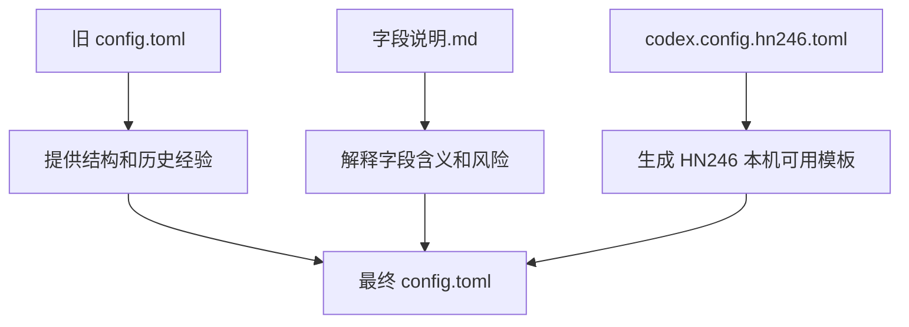
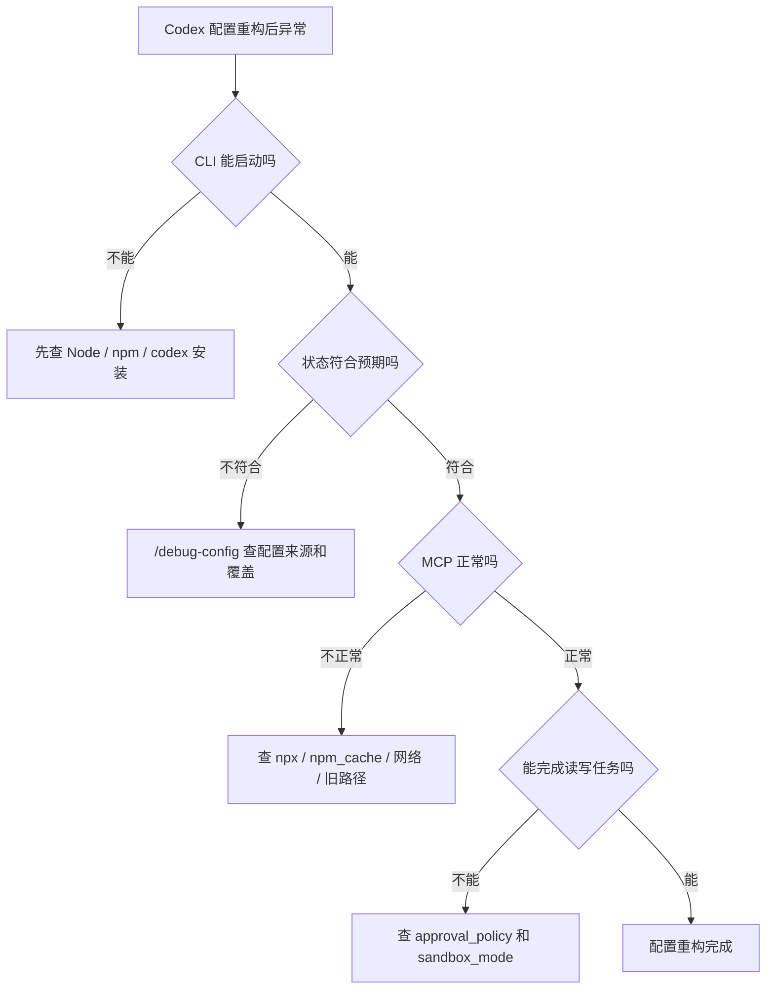

# 第九篇：Codex / CCSwitch 本机配置重构实战（HN246 版）

> 更新时间：2026-06-04  
> 定位：本机配置实战篇。专门解决“我手里有一份旧机器配置、一份字段说明、一份 HN246 本机替换版，到底该怎么安全合成到 `C:\Users\HN246\.codex\config.toml`”这个问题。  
> 前置建议：先读第三篇理解配置层级，再读第五篇查字段；如果只是要照着改本机配置，直接从第 3 节开始。  
> 安全边界：本文不会写入真实 API Key、真实 bearer token 或完整敏感凭据；公开笔记里统一用 `sk-***`、`你的Key` 这类占位。

[[toc]]

---

## 1. 这次三份文件分别负责什么

主人这次给的三份文件，本质上不是三份同等配置，而是三层资料：

| 文件 | 角色 | 适合怎么用 |
|---|---|---|
| `config.toml` | 旧配置或参考配置 | 看整体结构、字段顺序、注释口径和 MCP / 插件 / Desktop 写法 |
| `Codex-CCSwitch配置字段说明.md` | 字段说明文档 | 复习每个字段含义，避免只会复制、不知道哪一行会影响什么 |
| `codex.config.hn246.toml` | HN246 本机直接替换版 | 作为重构后的主模板，再按安全规则处理敏感字段 |

更稳的理解方式是：



所以不要把三份文件简单互相覆盖。  
这次重构真正要做的是：

1. 保留旧配置中仍然有价值的字段结构
2. 用字段说明确认每一类字段的职责
3. 用 HN246 版本修正 Windows 用户名、npm 缓存、项目目录和 VS Code 打开路径
4. 把敏感认证字段从公开文章里打码
5. 最后通过 `codex`、`/status`、`/mcp` 验证真实生效值

---

## 2. 先分清：这不是 CCSwitch 全局教程，而是 Codex 配置落地

CCSwitch 更像“配置切换和同步工具”，Codex 的 `config.toml` 才是 Codex 客户端真实读取的配置文件。

这次要避免一个常见误区：

> 不要以为 CCSwitch 里看起来已经切好了，Codex 当前会话就一定读到了正确配置。

真实排查时至少要分四层：

| 层级 | 看什么 | 典型问题 |
|---|---|---|
| CCSwitch | provider 快照、导入导出、同步配置 | 跨机路径污染、旧用户名残留 |
| Codex 用户配置 | `C:\Users\HN246\.codex\config.toml` | provider、模型、审批、沙箱、MCP |
| Codex 凭据 | `auth.json`、keyring、环境变量、token 字段 | 401、403、key 过期、字段放错 |
| 当前会话 | `/status`、`/debug-config`、`/mcp` | 改了配置但旧会话没刷新、项目层覆盖 |

本文重点落在第二层和第三层。

---

## 3. HN246 本机版配置的核心结论

如果主人只想知道本机这份配置的主线，记住下面几句：

1. 默认 provider 是 `my_codex`
2. 默认模型示例是 `gpt-5.5`
3. 日常权限组合是 `approval_policy = "on-request"` + `sandbox_mode = "workspace-write"`
4. 长上下文配置是 `model_context_window = 1050000` + `model_auto_compact_token_limit = 900000`
5. MCP 主要启用 `context7` 和 `chrome-devtools`
6. Windows 路径统一改到 `C:\Users\HN246`
7. 真实 token 不应该出现在公开笔记、Git 仓库或截图里

这套配置不是“最省钱模板”，而是“长上下文、中文解释较完整、允许联网查资料、适合本机开发”的模板。

---

## 4. 可直接参考的脱敏模板

下面这份模板按 HN246 本机路径整理，但已经把敏感 token 脱敏。  
真正写入 `C:\Users\HN246\.codex\config.toml` 时，认证字段要以主人本机实际可用方式为准。

```toml
#:schema https://developers.openai.com/codex/config-schema.json

model_provider = "my_codex"
model = "gpt-5.5"

approval_policy = "on-request"
approvals_reviewer = "user"
sandbox_mode = "workspace-write"

model_reasoning_effort = "medium"
model_context_window = 1050000
model_auto_compact_token_limit = 900000

disable_response_storage = true
windows_wsl_setup_acknowledged = true
model_verbosity = "high"

[sandbox_workspace_write]
network_access = true

[model_providers]

[model_providers.my_codex]
name = "my_codex"
base_url = "https://yfy.zhouyang168.top/v1"
wire_api = "responses"
requires_openai_auth = true

# 不建议把真实 token 写进公开笔记或仓库。
# 如果本机确实依赖该字段，只能写在本机私有 config.toml 里：
# experimental_bearer_token = "sk-***"

[projects]

[projects.'c:\users\hn246']
trust_level = "trusted"

[projects.'c:\users\hn246\desktop']
trust_level = "trusted"

[projects.'c:\users\hn246\desktop\番茄']
trust_level = "trusted"

[projects.'c:\users\hn246\desktop\git项目']
trust_level = "trusted"

[mcp_servers]

[mcp_servers.context7]
type = "stdio"
command = "cmd"
args = ["/c", "npx", "-y", "@upstash/context7-mcp"]

[mcp_servers.chrome-devtools]
type = "stdio"
command = "cmd"
args = ["/c", "npx", "-y", "chrome-devtools-mcp@latest", "--no-usage-statistics"]
startup_timeout_ms = 20000

[mcp_servers.chrome-devtools.env]
CHROME_DEVTOOLS_MCP_NO_USAGE_STATISTICS = "1"
PROGRAMFILES = "C:\\Program Files"
SystemRoot = "C:\\Windows"
npm_config_cache = "C:\\Users\\HN246\\.codex\\npm-cache"

[plugins]

[plugins."documents@openai-primary-runtime"]
enabled = true

[plugins."spreadsheets@openai-primary-runtime"]
enabled = true

[plugins."presentations@openai-primary-runtime"]
enabled = true

[desktop]
appearanceTheme = "dark"
usePointerCursors = false
followUpQueueMode = "queue"
reviewDelivery = "inline"
integratedTerminalShell = "powershell"
localeOverride = "zh-CN"
selected-avatar-id = "dewey"
dictationDictionary = []
show-context-window-usage = true

[desktop.appearanceDarkChromeTheme]
accent = "#339cff"
contrast = 60
ink = "#ffffff"
opaqueWindows = false
surface = "#181818"

[desktop.appearanceDarkChromeTheme.fonts]

[desktop.appearanceDarkChromeTheme.semanticColors]
diffAdded = "#40c977"
diffRemoved = "#fa423e"
skill = "#ad7bf9"

[desktop.open-in-target-preferences]
global = "vscode"

[desktop.open-in-target-preferences.perPath]
"C:\\Users\\HN246\\Desktop\\番茄" = "vscode"
"C:\\Users\\HN246\\Desktop\\git项目" = "vscode"

[windows]
sandbox = "elevated"
```

---

## 5. 哪些字段是这次重构的“关键字段”

### 5.1 `model_provider`

```toml
model_provider = "my_codex"
```

它必须和下面 provider 块的名字一致：

```toml
[model_providers.my_codex]
```

如果这两个名字不一致，最常见表现是：

1. Codex 找不到 provider
2. 会话里仍然显示旧 provider
3. 模型列表和预期不一致

### 5.2 `model`

```toml
model = "gpt-5.5"
```

这里写的是默认模型名。  
注意它必须被当前网关支持，不是文章写了就一定能用。

如果网关后台还没开放这个模型，常见报错会接近：

1. `model_not_found`
2. `unsupported_model`
3. 模型列表里看不到对应项

### 5.3 `base_url`

```toml
base_url = "https://yfy.zhouyang168.top/v1"
```

这是 provider 请求地址。  
切中转平台时最常改这里，但只改这里通常不够，还要同时确认：

1. `model_provider`
2. `model`
3. `requires_openai_auth`
4. `experimental_bearer_token` 或环境变量
5. `wire_api`

### 5.4 `requires_openai_auth`

```toml
requires_openai_auth = true
```

这个字段决定 provider 是否复用 OpenAI / Codex 登录鉴权。  
如果你的网关是普通 OpenAI-compatible API，更常见写法是：

```toml
requires_openai_auth = false
env_key = "OPENAI_API_KEY"
```

但本机模板里沿用了当前能跑通的方式，所以不要在没验证前随便改。

### 5.5 `experimental_bearer_token`

这类字段最敏感。  
本机私有配置里可以存在，但公开文章里不要写真实值：

```toml
experimental_bearer_token = "sk-***"
```

更稳的长期方式是把 key 放进环境变量：

```powershell
[Environment]::SetEnvironmentVariable("OPENAI_API_KEY", "你的Key", "User")
```

然后在配置里写：

```toml
env_key = "OPENAI_API_KEY"
```

是否能改成这种方式，取决于当前网关是否支持普通 API Key 鉴权。

---

## 6. 审批、沙箱、联网：本机默认为什么这样配

### 6.1 日常推荐组合

```toml
approval_policy = "on-request"
sandbox_mode = "workspace-write"
```

这组适合日常开发，因为它的边界比较清楚：

1. 可以读写当前工作区
2. 高风险或越权动作再让主人确认
3. 不会一上来就完全放开整台机器

### 6.2 不建议默认写成完全访问

下面这组不是不能用，而是不适合长期默认：

```toml
approval_policy = "never"
sandbox_mode = "danger-full-access"
```

它适合：

1. 临时排障
2. 隔离环境
3. 主人明确知道会影响哪些路径

不适合：

1. 日常公开仓库开发
2. 多项目混开
3. 配置里还有跨机同步或旧路径污染风险时

### 6.3 workspace-write 下的联网

```toml
[sandbox_workspace_write]
network_access = true
```

这行主要让 Codex 在 workspace-write 模式下可以联网查资料、下载 MCP 包。  
如果遇到安全要求更严格的项目，可以临时改成：

```toml
network_access = false
```

---

## 7. 上下文配置怎么理解

本机模板写的是长上下文档：

```toml
model_context_window = 1050000
model_auto_compact_token_limit = 900000
```

这里最容易误解的点是：

1. `model_context_window` 不是把任何模型都强行变成 1M 上下文
2. 它只是告诉 Codex 按这个预算做上下文管理
3. 真正能不能撑住，还要看模型和网关实际能力
4. `model_auto_compact_token_limit` 必须小于 `model_context_window`

如果主人想要更稳、更省、更少失败，可以改成日常档：

```toml
model_context_window = 500000
model_auto_compact_token_limit = 400000
```

如果只是轻量任务，也可以降得更保守：

```toml
model_context_window = 300000
model_auto_compact_token_limit = 260000
```

---

## 8. MCP 配置：Context7 和 Chrome DevTools 各管什么

### 8.1 Context7

```toml
[mcp_servers.context7]
type = "stdio"
command = "cmd"
args = ["/c", "npx", "-y", "@upstash/context7-mcp"]
```

它适合：

1. 查新版框架文档
2. 查库 API 示例
3. 避免只靠模型记忆写过时用法

### 8.2 Chrome DevTools

```toml
[mcp_servers.chrome-devtools]
type = "stdio"
command = "cmd"
args = ["/c", "npx", "-y", "chrome-devtools-mcp@latest", "--no-usage-statistics"]
startup_timeout_ms = 20000
```

它适合：

1. 调试页面
2. 看控制台错误
3. 截图验收 UI
4. 检查网络请求

### 8.3 Windows 环境变量为什么要补

```toml
[mcp_servers.chrome-devtools.env]
CHROME_DEVTOOLS_MCP_NO_USAGE_STATISTICS = "1"
PROGRAMFILES = "C:\\Program Files"
SystemRoot = "C:\\Windows"
npm_config_cache = "C:\\Users\\HN246\\.codex\\npm-cache"
```

这几行的目的不是增强模型能力，而是降低 Windows 下 `npx` 或 Chrome DevTools MCP 启动失败概率。

尤其是 `npm_config_cache`，跨机同步后最容易残留旧用户名路径。  
如果它还指向 `C:\Users\Administrator\...`，就要修回 HN246 本机路径。

---

## 9. projects 信任目录怎么写更稳

本机模板里写了：

```toml
[projects.'c:\users\hn246']
trust_level = "trusted"

[projects.'c:\users\hn246\desktop']
trust_level = "trusted"

[projects.'c:\users\hn246\desktop\git项目']
trust_level = "trusted"
```

这表示这些目录下的项目被 Codex 视为可信。  
越大的路径越方便，但影响范围也越大。

更保守的写法是只信任具体项目：

```toml
[projects.'c:\users\hn246\desktop\git项目\个人技术博客网站']
trust_level = "trusted"
```

如果主人只是自己本机开发，信任 `Desktop\git项目` 很方便。  
如果以后接触陌生仓库，更建议只信任具体仓库目录。

---

## 10. Desktop 配置不要和模型能力混在一起

下面这些字段大多数只影响 Codex Desktop 界面：

```toml
[desktop]
appearanceTheme = "dark"
integratedTerminalShell = "powershell"
localeOverride = "zh-CN"
show-context-window-usage = true
```

它们不会让模型“更聪明”，也不会改变 provider。  
最容易混的是：

| 字段 | 真正作用 |
|---|---|
| `show-context-window-usage` | 是否显示上下文用量 |
| `model_context_window` | Codex 按多大上下文窗口做预算 |
| `integratedTerminalShell` | Desktop 集成终端用 PowerShell 还是 cmd |
| `sandbox_mode` | 当前任务的文件访问和写入边界 |

所以如果界面上没显示上下文用量，改 `show-context-window-usage`。  
如果上下文预算不对，改 `model_context_window` 和 `model_auto_compact_token_limit`。

---

## 11. Windows 沙箱字段和任务沙箱字段不是一回事

本机模板里有两类沙箱：

```toml
sandbox_mode = "workspace-write"
```

以及：

```toml
[windows]
sandbox = "elevated"
```

它们不是同一个东西。

| 字段 | 控制什么 |
|---|---|
| `sandbox_mode` | Codex 当前任务能读写什么范围 |
| `[windows].sandbox` | Windows 上使用哪种沙箱实现 |

日常理解：

1. `sandbox_mode` 是权限策略
2. `[windows].sandbox` 是 Windows 实现方式
3. 不要用 `[windows].sandbox = "elevated"` 来代替 `sandbox_mode`

---

## 12. 真实替换前的安全步骤

如果主人准备把 HN246 模板写进本机 `C:\Users\HN246\.codex\config.toml`，建议按这个顺序：

### 第一步：备份旧配置

```powershell
Copy-Item "$env:USERPROFILE\.codex\config.toml" "$env:USERPROFILE\.codex\config.toml.bak"
```

### 第二步：确认旧配置里有没有真实 token

```powershell
Select-String -Path "$env:USERPROFILE\.codex\config.toml" -Pattern "token|key|sk-" -CaseSensitive:$false
```

如果有，不要截图，不要提交 Git。

### 第三步：确认路径不再残留旧用户名

```powershell
Select-String -Path "$env:USERPROFILE\.codex\config.toml" -Pattern "Administrator|旧用户名|npm-cache"
```

只要看到旧机器路径，就优先修正。

### 第四步：写入新配置后重启 Codex

配置文件改完后，建议新开一次 Codex 会话。  
旧会话可能保留旧状态，不适合作为最终验证依据。

---

## 13. 替换后的最小验证流程

### 13.1 先看 CLI 能不能启动

```powershell
codex --version
codex
```

### 13.2 进入会话后看状态

优先执行：

```text
/status
```

重点看：

1. 当前模型是不是 `gpt-5.5`
2. provider 是不是 `my_codex`
3. 权限是不是 workspace-write / on-request 这一类预期组合
4. 上下文显示是否符合预期

### 13.3 再看配置来源

```text
/debug-config
```

重点看：

1. 是否读取了 `C:\Users\HN246\.codex\config.toml`
2. 有没有项目 `.codex/config.toml` 覆盖
3. profile 有没有覆盖模型或权限

### 13.4 最后看 MCP

```text
/mcp
```

重点看：

1. `context7` 是否能启动
2. `chrome-devtools` 是否能启动
3. 如果失败，错误里是否出现 npm、npx、旧路径、缓存目录或网络问题

---

## 14. 高频问题速查

### 14.1 改完还是旧模型

优先查：

1. 改的是不是 `C:\Users\HN246\.codex\config.toml`
2. 当前项目有没有 `.codex/config.toml`
3. 是否用了 `--profile`
4. 旧 Codex 会话是否没重启

### 14.2 MCP 启动失败

优先查：

1. `node -v`
2. `npm -v`
3. `npx -y @upstash/context7-mcp`
4. `npx -y chrome-devtools-mcp@latest --no-usage-statistics`
5. `npm_config_cache` 是否仍指向旧机器用户目录

### 14.3 出现 401 / 403

优先查：

1. `requires_openai_auth` 是否适合当前网关
2. token 是否过期
3. key 是否放在了正确字段
4. `base_url` 是否仍然是当前服务商地址
5. 当前服务商是否需要环境变量而不是登录鉴权

### 14.4 配置里有 `experimental_bearer_token`，到底要不要保留

判断标准：

1. 当前本机靠它能跑，就可以在本机私有配置里保留
2. 公开文章、截图、Git 仓库里必须打码或删除
3. 如果服务商支持环境变量，长期更建议迁到 `env_key`

### 14.5 跨机同步后路径污染

重点搜索这些词：

```powershell
Select-String -Path "$env:USERPROFILE\.codex\config.toml" -Pattern "Administrator|HN246|npm-cache|Desktop|\\.cache|\\.codex"
```

如果当前机器是 HN246，却看到大量 `Administrator` 路径，就说明配置里还混了旧机器痕迹。

---

## 15. 和本系列其他文章怎么分工

以后主人维护 Codex 资料，可以这样分：

1. 第三篇：解释配置层级和为什么改了不生效
2. 第四篇：讲官方、Packy、yunyi、rpcod 等多线路迁移
3. 第五篇：长期字段字典
4. 第七篇：命令、配置文件和 slash command 速查
5. 第六篇：CLI / 插件 / App 三端联动
6. 第八篇：当前常用功能和进阶工作流
7. 第九篇：HN246 本机配置怎么安全重构和验证

一句话总结：

> 第九篇不是替代字段字典，而是把字段字典落到主人这台 Windows 机器上的实战版。

---

## 16. 最后一张排查图



---

## 参考来源

1. 主人提供的 `C:\Users\HN246\Desktop\config.toml`
2. 主人提供的 `C:\Users\HN246\Desktop\Codex-CCSwitch配置字段说明.md`
3. 主人提供的 `C:\Users\HN246\Desktop\codex.config.hn246.toml`
4. 本系列：[第三篇：Codex 配置心智模型](#/note/AI工具/02_终端Agent流/Codex/03_Codex配置心智模型)
5. 本系列：[第五篇：Codex 配置字段字典](#/note/AI工具/02_终端Agent流/Codex/05_Codex配置字段字典)
6. 本系列：[第七篇：Codex 命令与配置文件速查](#/note/AI工具/02_终端Agent流/Codex/07_Codex命令与配置文件速查)
