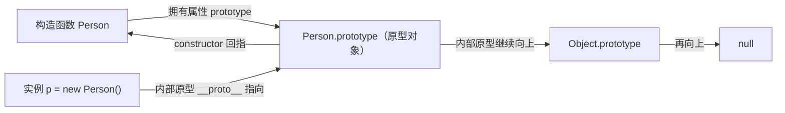
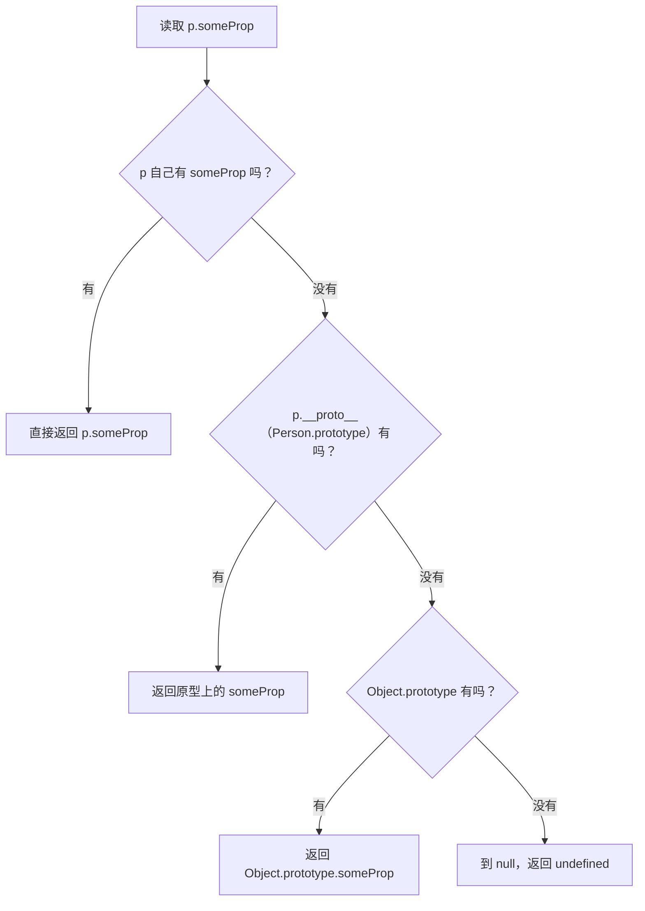
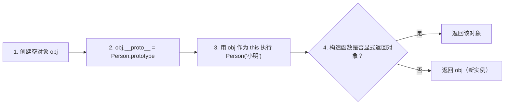

## 🧭 先救火：构造函数原型一眼看懂（看图版）
如果你现在被 `prototype / __proto__ / constructor` 绕晕，先记这一句：

```plain
函数身上看 prototype，实例身上看 __proto__，两者通常相等；
prototype 里又有 constructor 指回函数本体。
```

### 图1：构造函数、原型对象、实例之间的“三角关系”


ASCII 兜底图（Mermaid 不显示时看这个）：
```plain
Person (函数)
  └─ prototype ───────────────┐
                              ↓
                    Person.prototype (原型对象)
                      ├─ constructor ───────→ Person
                      └─ [[Prototype]] ────→ Object.prototype ─→ null
                              ↑
                              │
p = new Person() 的 __proto__ ┘
```

3 句话理解这张图：
1. `prototype` 是“函数专属属性”，普通对象默认没有这个属性。  
2. `__proto__`（或 `[[Prototype]]`）是“对象内部原型引用”，实例靠它连到原型对象。  
3. `constructor` 只是一个普通属性，通常用于回指构造函数，但它可以被改写，不是绝对可靠的类型判断依据。

### 图2：访问属性时，JavaScript 到底怎么找


最小例子：
```javascript
function Person(name) {
  this.name = name
}
Person.prototype.sayHi = function () {
  return '你好，' + this.name
}

const p = new Person('小明')
console.log(p.name)   // 自身属性：小明
console.log(p.sayHi()) // 原型方法：你好，小明
```

### 图3：`new Person('小明')` 在底层干了什么


对应的“近似手写版”：
```javascript
function myNew(Ctor, ...args) {
  const obj = Object.create(Ctor.prototype)
  const result = Ctor.apply(obj, args)
  return (result !== null && (typeof result === 'object' || typeof result === 'function'))
    ? result
    : obj
}
```

### 两个高频误区（你现在最容易踩）
1. 误区：`prototype` 和 `__proto__` 是一个东西  
正确：`prototype` 是函数上的属性；`__proto__` 是对象的内部原型引用，语义和位置完全不同。  
2. 误区：`constructor` 永远可靠  
正确：当你重写原型（如 `Person.prototype = {}`）后，`constructor` 可能丢失或指错，需手动修复。

---

## 📌 核心要点摘要
### 1. **Object.prototype.toString()**
```javascript
// 原始版本，返回类型标识字符串
Object.prototype.toString.call(value)  // 返回 "[object Type]"
```

### 2. **为什么需要 .call()**
```javascript
// ❌ 不能直接调用
Object.prototype.toString()  // 返回 "[object Object]"（this指向Object.prototype）

// ✅ 必须用 .call() 指定this
Object.prototype.toString.call(arr)  // 返回 "[object Array]"
```

### 3. **数组的特殊性**
```javascript
// 数组重写了toString方法
Array.prototype.toString !== Object.prototype.toString
[1,2,3].toString()  // "1,2,3"（重写版本）
Object.prototype.toString.call([1,2,3])  // "[object Array]"（原始版本）
```

## 🔍 原型链查找机制
### **正常方法调用**（会走原型链）
```javascript
arr.toString()
↓
1. 检查 arr 自身 → 没有 toString
2. 检查 Array.prototype → 找到！调用
```

### **call 调用**（直接执行指定函数）
```javascript
Object.prototype.toString.call(arr)
↓
1. 直接获取 Object.prototype.toString 函数
2. 以 arr 为 this 执行该函数
3. 没有原型链查找过程！
```

## 📝 类型检测完全指南
### 1. **通用类型检测函数**
```javascript
function getType(value) {
    return Object.prototype.toString.call(value).slice(8, -1)
}
// 示例：getType([]) → "Array"
```

### 2. **各种类型的检测结果**
| 值/对象 | Object.prototype.toString.call() |
| --- | --- |
| {} | "[object Object]" |
| [] | "[object Array]" |
| null | "[object Null]" |
| undefined | "[object Undefined]" |
| function(){} | "[object Function]" |
| new Date() | "[object Date]" |
| 123 | "[object Number]" |
| "abc" | "[object String]" |
| true | "[object Boolean]" |


### 3. **为什么其他方法不准确**
```javascript
typeof []        // "object"（不准确）
typeof null      // "object"（错误！）
[] instanceof Array  // true（但跨iframe可能失效）
Array.isArray([])    // true（仅限数组检测）
```

## 🎯 .call() 的工作原理
### **核心作用**
```javascript
// .call() 改变函数内部的 this 指向
function showThis() {
    console.log(this)
}

showThis.call({name: "John"})  // {name: "John"}
```

### **在类型检测中的应用**
```javascript
// 相当于：
const toStringFunc = Object.prototype.toString
toStringFunc.call(arr)  // 把 arr 作为 this 传入函数
```

## 💡 关键概念对比
### **函数 vs 方法**
```javascript
// 函数：独立的代码块
const func = Object.prototype.toString

// 方法：属于对象的函数
obj.toString  // 这是 obj 的方法

// Object.prototype.toString 是函数，也是 Object.prototype 的方法
```

### **[[Class]] 内部属性**
```javascript
// 每个JavaScript对象都有一个 [[Class]] 内部属性
// Object.prototype.toString 就是读取这个属性

// 伪代码表示：
Object.prototype.toString = function() {
    return `[object ${this.[[Class]]}]`
}
```

## 🛠️ 实用代码片段
### 1. **类型判断工具**
```javascript
const Type = {
    isArray: val => Array.isArray(val),
    isObject: val => Object.prototype.toString.call(val) === '[object Object]',
    isFunction: val => typeof val === 'function',
    isNull: val => Object.prototype.toString.call(val) === '[object Null]',
    isUndefined: val => Object.prototype.toString.call(val) === '[object Undefined]',
    isDate: val => Object.prototype.toString.call(val) === '[object Date]',
    isRegExp: val => Object.prototype.toString.call(val) === '[object RegExp]'
}
```

### 2. **安全检测函数**
```javascript
function safeToString(value) {
    // 处理 null 和 undefined
    if (value == null) {
        return String(value)
    }
    
    // 优先使用自定义 toString
    if (typeof value.toString === 'function') {
        try {
            return value.toString()
        } catch(e) {
            // 如果出错，使用类型标识
        }
    }
    
    // 最后使用类型标识
    return Object.prototype.toString.call(value)
}
```

## 📊 性能优化建议
### **缓存函数引用**
```javascript
// 优化前
for (let i = 0; i < 1000000; i++) {
    Object.prototype.toString.call(arr)
}

// 优化后
const toString = Object.prototype.toString
for (let i = 0; i < 1000000; i++) {
    toString.call(arr)
}
```

## 🚀 实战应用场景
### 1. **跨iframe类型检测**
```javascript
// 只有 Object.prototype.toString.call() 能可靠工作
const iframeArray = document.createElement('iframe').contentWindow.Array
const arr = new iframeArray(1, 2, 3)

arr instanceof Array  // false（失效）
Object.prototype.toString.call(arr)  // "[object Array]"（正确）
```

### 2. **深拷贝中的类型判断**
```javascript
function deepClone(obj) {
    // 精确判断类型
    const type = Object.prototype.toString.call(obj).slice(8, -1)
    
    switch(type) {
        case 'Array': return obj.map(deepClone)
        case 'Object': 
            const cloned = {}
            for(let key in obj) {
                cloned[key] = deepClone(obj[key])
            }
            return cloned
        case 'Date': return new Date(obj.getTime())
        case 'RegExp': return new RegExp(obj)
        default: return obj
    }
}
```

## 🎓 记忆口诀与总结
### **核心口诀**
```plain
类型检测要精准，toString加call
数组转换特殊化，原型链上被重写
call不查原型链，直接执行函数体
各种类型有标识，格式固定[object]
```

### **快速决策指南**
```javascript
// Q: 如何判断数组？
// A: Array.isArray() > Object.prototype.toString.call() > instanceof

// Q: 如何获取精确类型？
// A: Object.prototype.toString.call(value)

// Q: 如何安全地转字符串？
// A: 先判断是否有自定义toString，再用类型标识兜底
```

## 📚 扩展学习
### **相关方法**
```javascript
// .apply() - 数组传参
Object.prototype.toString.apply(arr)

// .bind() - 创建新函数
const getArrayType = Object.prototype.toString.bind([])
console.log(getArrayType())  // "[object Array]"
```

### **现代JavaScript**
```javascript
// ES6+ 可以使用 Symbol.toStringTag
class MyClass {
    get [Symbol.toStringTag]() {
        return 'MyClass'
    }
}
console.log(Object.prototype.toString.call(new MyClass()))  // "[object MyClass]"
```

---

## ✅ 最后检查清单
- [ ] 理解 Object.prototype.toString.call() 的作用
- [ ] 知道为什么不能直接调用 Object.prototype.toString()
- [ ] 明白数组重写了 toString 方法
- [ ] 掌握 .call() 不会触发原型链查找
- [ ] 会写通用的类型检测函数
- [ ] 了解各种类型检测方法的优缺点

**记住**：当需要精确类型检测时，`Object.prototype.toString.call()` 是最可靠的选择！

