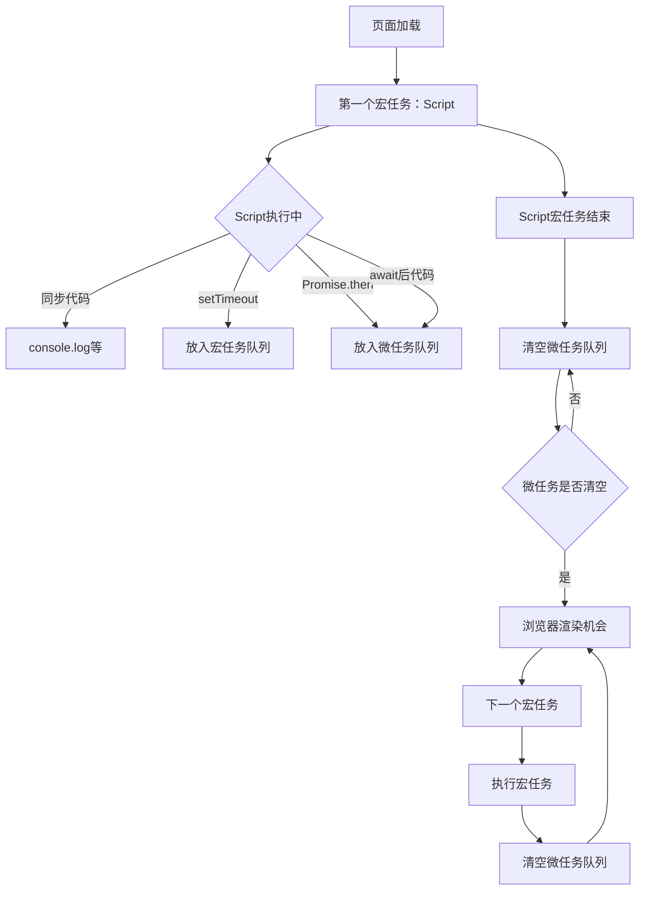

# 宏任务与微任务：小白速懂版

## 🎯 最关键认知：Script 本身就是一个宏任务

这是理解事件循环的突破点！当页面加载时，**最外层同步代码（Script）本身就是第一个宏任务**。

先背一句最重要的话：

**一轮事件循环里，先执行 1 个宏任务，再把所有微任务一次性清空，最后浏览器有机会再渲染页面。**

## 📋 事件循环执行流程图



如果Mermaid不支持，看这个ASCII版本：

```
┌─────────────┐     ┌─────────────┐     ┌─────────────┐
│  宏任务1    │─────▶│  清空微任务   │─────▶│   浏览器渲染  │
│ (Script)    │     │             │     │             │
└─────────────┘     └─────────────┘     └─────────────┘
       │                                         │
       ▼                                         │
┌─────────────┐                                 │
│  宏任务2    │─────────────────────────────────┘
│ (setTimeout)│
└─────────────┘
```

你可以把它想成：

- **宏任务** = 一整单大活，按顺序一个一个做
- **微任务** = 当前这单做完后，马上要结算的小纸条

## 一、先看最容易记住的分类
### 1. 宏任务
常见的有：

- `setTimeout`
- `setInterval`
- 点击、输入这类用户事件回调
- XHR 的回调

记法：
- `setTimeout(fn, 0)` 这行代码本身是同步的
- 真正晚点执行的是里面的回调

### 2. 微任务
常见的有：

- `Promise.then`
- `Promise.catch`
- `Promise.finally`
- `await` 后面的代码
- `queueMicrotask`
- `MutationObserver`

记法：
- `new Promise(...)` 里面的执行代码是同步的
- 真正进入微任务队列的是 `.then(...)` 这些后续回调

## 二、最容易混淆的 3 个点
### 1. `fetch().then(...)` 不是宏任务
`fetch()` 会返回一个 Promise，所以：

- `fetch(url)` 这一步是同步发起
- `then(...)` 里的回调还是 **微任务**

### 2. `await` 不是“整段都异步”
`await` 前面的代码是同步的，`await` 后面的代码会放进微任务。

### 3. 微任务不是执行一个就停
微任务要 **清空整个队列**。  
如果某个微任务里又产生了新微任务，会继续执行，直到队列为空。

## 三、事件循环怎么跑
可以简单理解成这 4 步：

1. 先执行一个宏任务
2. 把微任务全部清空
3. 浏览器看看要不要渲染
4. 再执行下一个宏任务

## 四、先看一个最简单的例子
```javascript
console.log('1')

setTimeout(() => {
  console.log('2')
}, 0)

Promise.resolve().then(() => {
  console.log('3')
})

console.log('4')
```

### 输出顺序
`1 -> 4 -> 3 -> 2`

### 为什么
```
执行流程详解：

第一步：执行当前宏任务（Script）
┌─────────────────────────────────────┐
│ console.log('1')          → 输出 1   │
│ setTimeout回调           → 入宏队列  │
│ Promise.then回调         → 入微队列  │  
│ console.log('4')          → 输出 4   │
└─────────────────────────────────────┘
       ↓
第二步：Script宏任务结束，立即清空微任务
┌─────────────────────────────────────┐
│ Promise.then回调执行      → 输出 3   │
└─────────────────────────────────────┘
       ↓
第三步：执行下一个宏任务  
┌─────────────────────────────────────┐
│ setTimeout回调执行        → 输出 2   │
└─────────────────────────────────────┘
```
- `1` 和 `4`：属于当前宏任务（Script）的同步代码，最先执行
- `3`：属于当前宏任务结束后立即清空的微任务
- `2`：属于下一个宏任务，必须等当前轮次完全结束才执行

## 五、再看 async/await
```javascript
async function demo() {
  console.log('A')
  await 1
  console.log('B')
}

demo()
console.log('C')
```

### 结果顺序
`A -> C -> B`

### 为什么
1. `demo()` 进入后，`await` 前的 `A` 先同步执行
2. 遇到 `await` 后，函数暂停
3. 主线程继续执行 `console.log('C')`
4. 等同步代码跑完，`await` 后面的 `B` 作为微任务执行

## 六、面试时可以直接说
“宏任务可以理解成一单一单的大活，比如 `setTimeout` 和用户点击事件。微任务可以理解成当前这一单后面必须马上处理的小活，比如 `Promise.then` 和 `await` 后面的代码。每轮事件循环都会先执行一个宏任务，再把所有微任务清空，最后看浏览器要不要渲染。”

## 七、一句话记忆

**第一轮很重要，Script就是宏任务！**
**当前宏完成立即清微任务，再轮下个宏任务。**

更详细的7步记忆法：
1. **页面加载，Script是第一个宏任务**
2. **当前宏任务的同步代码先执行完**
3. **当前宏任务期间产生的微任务立刻清空**  
4. **微任务里产生的新微任务继续清空**
5. **所有微任务清空后，浏览器可能渲染**
6. **下一个宏任务开始执行**
7. **重复2-6步...**

面试回答模板：
"**Script本身就是第一个宏任务，执行完当前宏任务后立即清空所有微任务，然后才开始下一个宏任务。所以Promise.then比setTimeout先执行，因为Promise属于当前宏任务的微任务，而setTimeout属于下一个宏任务。**"

## 参考资料（规范/官方）
- HTML Standard（Event Loop / Processing Model）  
  https://html.spec.whatwg.org/multipage/webappapis.html#event-loops
- DOM Standard（MutationObserver microtask）  
  https://dom.spec.whatwg.org/
- MDN: Using microtasks in JavaScript with `queueMicrotask()`  
  https://developer.mozilla.org/en-US/docs/Web/API/HTML_DOM_API/Microtask_guide
- MDN: `Promise.prototype.then()`  
  https://developer.mozilla.org/en-US/docs/Web/JavaScript/Reference/Global_Objects/Promise/then
- MDN: `Window.fetch()`  
  https://developer.mozilla.org/en-US/docs/Web/API/Window/fetch

